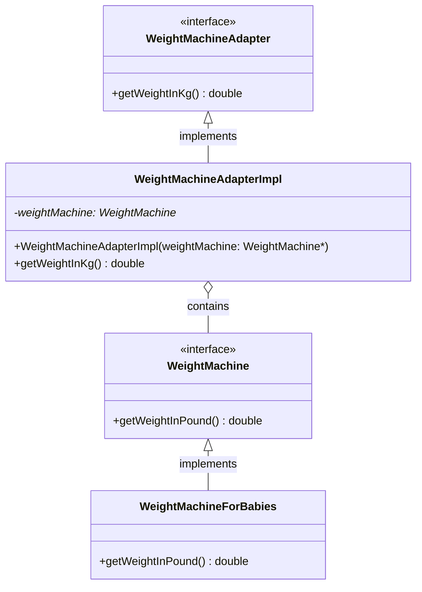
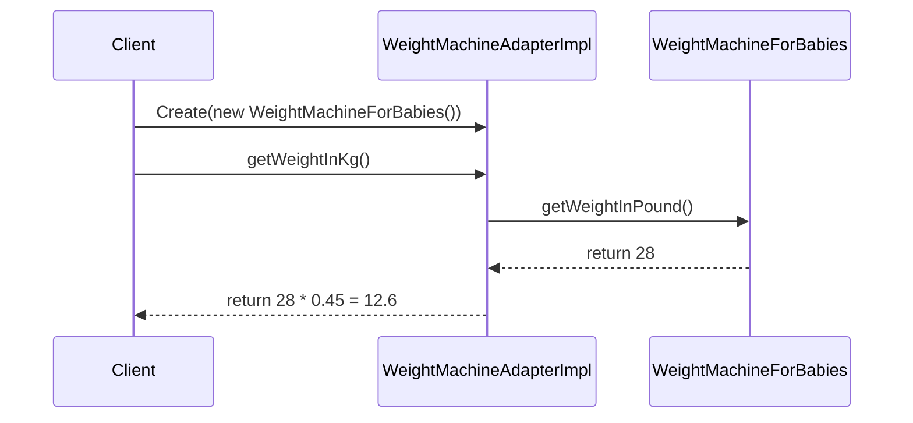

# Adapter Design Pattern

## Introduction

The code demonstrates the **Adapter Design Pattern**, not the Composite pattern. The Adapter pattern is a structural design pattern that allows objects with incompatible interfaces to work together. It acts as a bridge between two incompatible interfaces.

## Problem Statement

In this example, we have:
- A `WeightMachine` interface that provides weight in pounds
- A need to use this interface in a system that works with kilograms

Rather than modifying the original code (which might be part of a third-party library or legacy system), we create an adapter that converts pounds to kilograms.

## Implementation in the Code

### Class Structure

1. **Adaptee**: `WeightMachine` (interface) and `WeightMachineForBabies` (implementation)
   - Provides weight in pounds through `getWeightInPound()`

2. **Target Interface**: `WeightMachineAdapter` 
   - Defines the interface our client code expects: `getWeightInKg()`

3. **Adapter**: `WeightMachineAdapterImpl`
   - Implements the `WeightMachineAdapter` interface
   - Contains a reference to a `WeightMachine` object
   - Translates the call from `getWeightInKg()` to `getWeightInPound()` and performs the conversion

4. **Client**: `main.cpp`
   - Uses the adapter to get weight in kilograms

## UML Class Diagram



## Sequence Diagram



## Flow Chart

```mermaid
flowchart TD
    A[Client needs weight in kg] --> B[Client calls adapter.getWeightInKg()]
    B --> C[Adapter calls weightMachine.getWeightInPound()]
    C --> D[WeightMachine returns weight in pounds]
    D --> E[Adapter converts pounds to kg]
    E --> F[Adapter returns weight in kg to client]
```

## Key Points About the Adapter Pattern

1. **Purpose**: Convert the interface of a class into another interface clients expect.
2. **Benefit**: Allows classes to work together that couldn't otherwise because of incompatible interfaces.
3. **Types**:
   - **Class Adapter**: Uses inheritance (multiple inheritance in languages that support it)
   - **Object Adapter**: Uses composition (this example uses an object adapter)
4. **When to use**:
   - When you want to use an existing class, but its interface doesn't match what you need
   - When you want to create a reusable class that cooperates with classes that don't necessarily have compatible interfaces
   - When you need to use several existing subclasses but it's impractical to adapt their interface by subclassing each one

## The Composite Pattern vs. Adapter Pattern

For clarity, since you initially asked about the Composite pattern:

- **Adapter Pattern**: Converts one interface to another (demonstrated in this code)
- **Composite Pattern**: Composes objects into tree structures to represent part-whole hierarchies, letting clients treat individual objects and compositions uniformly (not demonstrated in this code)

## Running This Code

The example creates an adapter for a baby weight machine and converts the weight from pounds to kilograms:

```cpp
WeightMachineAdapter* weightMachineAdapter = new WeightMachineAdapterImpl(new WeightMachineForBabies());
cout << weightMachineAdapter->getWeightInKg() << endl;  // Output: 12.6
```

The output will be 12.6 kg (28 pounds × 0.45 conversion factor).
