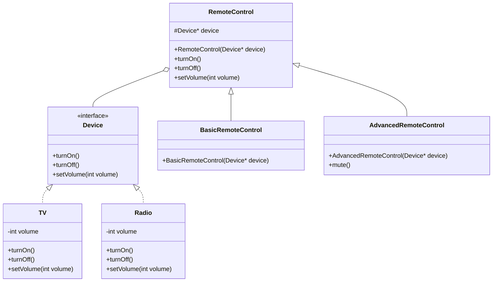
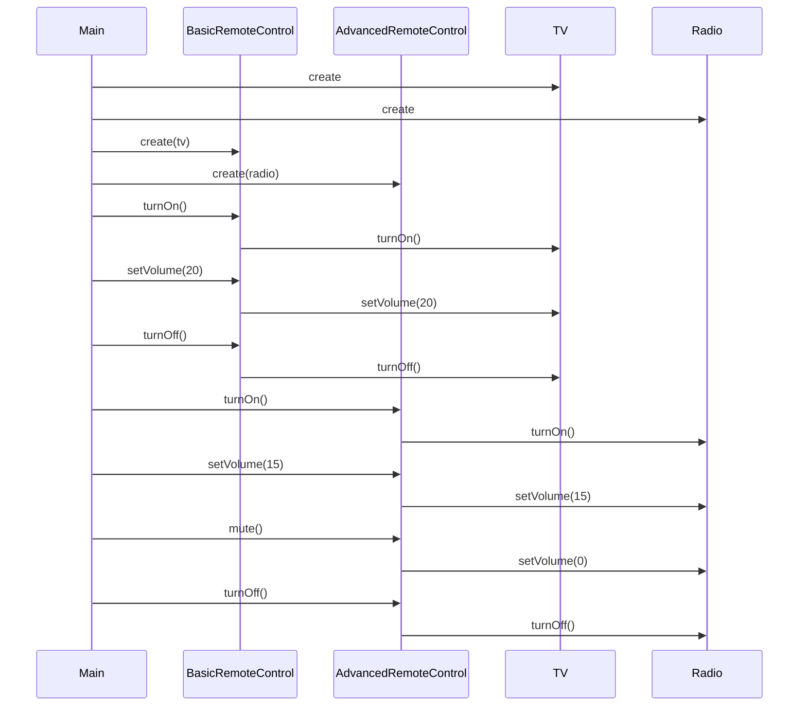
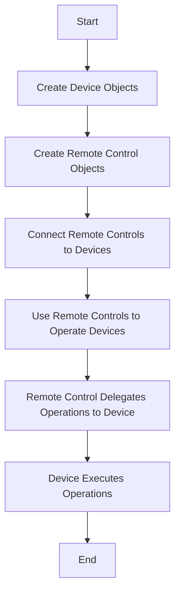
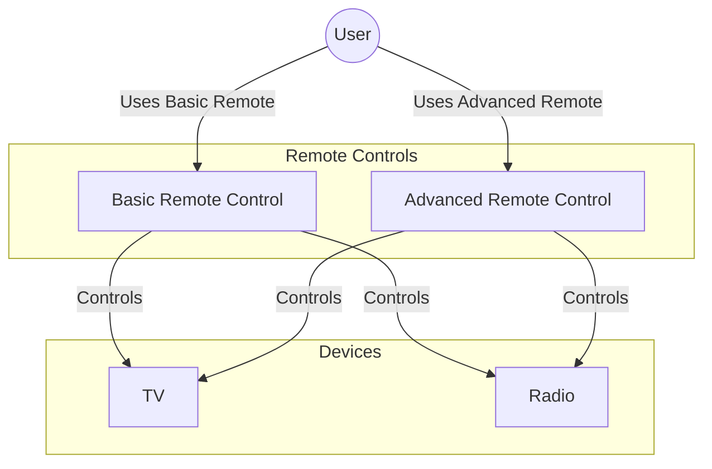
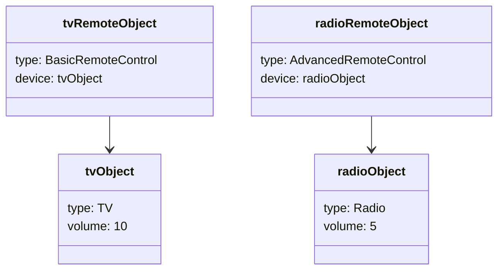

# Bridge Design Pattern

## Introduction

The Bridge Design Pattern is a structural design pattern that decouples an abstraction from its implementation, allowing the two to vary independently. It's particularly useful when both the abstraction and its implementation need to be extended independently.

## Problem Statement

When dealing with hierarchical inheritance, extending both the abstraction and its implementation can lead to class explosion. For example, if you have different types of devices (TV, Radio) and different types of remote controls (Basic, Advanced), a traditional inheritance approach would require creating multiple combined classes (BasicTVRemote, AdvancedTVRemote, BasicRadioRemote, AdvancedRadioRemote).

## Solution

The Bridge pattern addresses this by separating the abstraction (RemoteControl) from its implementation (Device). This way, we can extend both independently:

- Add new device types (TV, Radio, DVD, etc.) without modifying the remote controls
- Add new remote control types (Basic, Advanced, Pro, etc.) without modifying the devices

## Implementation

### Class Diagram



### Components

1. **Abstraction (RemoteControl)**:
   - Defines the interface for controlling devices
   - Contains a reference to the implementation (Device)

2. **Refined Abstraction (BasicRemoteControl, AdvancedRemoteControl)**:
   - Extends the abstraction with additional functionality
   - AdvancedRemoteControl adds mute functionality

3. **Implementation (Device)**:
   - Defines the interface for device operations
   - Abstract class/interface implemented by concrete devices

4. **Concrete Implementation (TV, Radio)**:
   - Implements the Device interface
   - Provides specific implementations for different devices

## Code Analysis

### Implementation Interface (Device.hpp)

```cpp
class Device{
    public:
        virtual void turnOn() = 0;
        virtual void turnOff() = 0;
        virtual void setVolume(int volume) = 0;
};
```

The Device interface declares the operations that all concrete devices must implement.

### Concrete Implementations (TV.hpp, Radio.hpp)

```cpp
class TV : public Device{
    int volume = 10;

    public:
        void turnOn() override
        {
            cout << "TV is turned ON." << endl;
        }

        void turnOff() override
        {
            cout << "TV is turned OFF " << endl;
        }

        void setVolume(int volume) override
        {
            this->volume = volume;
            cout << "TV volume is set to " << this->volume << endl;
        }
};
```

```cpp
class Radio : public Device{
    int volume = 5;

    public:
        void turnOn() override
        {
            cout << "Radio is turned ON" << endl;
        }

        void turnOff() override
        {
            cout << "Radio is turned OFF" << endl;
        }

        void setVolume(int volume) override
        {
            this->volume = volume;
            cout << "Radio volume is set to " << this->volume << endl;
        }
};
```

Each concrete device implements the Device interface with its own behavior.

### Abstraction (RemoteControl.hpp)

```cpp
class RemoteControl{
    protected:
        Device* device;

    public:
        RemoteControl(Device* device)
        {
            this->device = device;
        }

        void turnOn()
        {
            device->turnOn();
        }

        void turnOff()
        {
            device->turnOff();
        }

        void setVolume(int volume)
        {
            device->setVolume(volume);
        }
};
```

The RemoteControl class maintains a reference to a Device object and delegates the operations to it.

### Refined Abstractions (BasicRemoteControl.hpp, AdvancedRemoteControl.hpp)

```cpp
class BasicRemoteControl : public RemoteControl{
    public:
        BasicRemoteControl(Device* device) : RemoteControl(device) {}
};
```

```cpp
class AdvancedRemoteControl : public RemoteControl{
    public:
        AdvancedRemoteControl(Device* device) : RemoteControl(device) {}

        void mute()
        {
            cout << "Muting the device... " << endl;
            device->setVolume(0);
        }
};
```

The refined abstractions extend the base RemoteControl. The AdvancedRemoteControl adds a mute function.

### Client Code (main.cpp)

```cpp
int main()
{
    Device* tv = new TV();
    Device*  radio = new Radio();

    RemoteControl* tvRemote = new BasicRemoteControl(tv);
    RemoteControl* radioRemote = new AdvancedRemoteControl(radio);

    cout << "Using TV Remote: " << endl;
    tvRemote->turnOn();
    tvRemote->setVolume(20);
    tvRemote->turnOff();

    cout << endl << "Using Advanced Radio Remote" << endl;
    radioRemote->turnOn();
    radioRemote->setVolume(15);
    ((AdvancedRemoteControl*) radioRemote)->mute();
    radioRemote->turnOff();

    return 0;
}
```

The client code creates concrete devices and remote controls, connecting them using the bridge pattern.

## Sequence Diagram



## Activity Diagram



## Use Case Diagram



## Object Diagram



## Benefits of the Bridge Pattern

1. **Decoupling**: Separates the abstraction from its implementation, allowing them to vary independently
2. **Extensibility**: New implementations and abstractions can be added without modifying existing code
3. **Hiding Implementation Details**: Clients don't need to know the implementation details
4. **Avoids Class Explosion**: Prevents the exponential growth of classes when extending both abstractions and implementations

## When to Use the Bridge Pattern

- When you want to avoid permanent binding between an abstraction and its implementation
- When both the abstraction and implementation should be extensible independently
- When changes in the implementation should not impact the client code
- When you have a proliferation of classes due to a two-dimensional hierarchy

## Drawbacks

- Increased complexity by introducing new abstractions
- May be overkill for simple class hierarchies
- Requires designing up front, difficult to retrofit into existing code

## Conclusion

The Bridge Pattern provides a flexible way to decouple abstractions from implementations, allowing each to evolve independently. In the provided example, it allows for different types of remote controls to work with different types of devices without creating a combinatorial explosion of classes.
