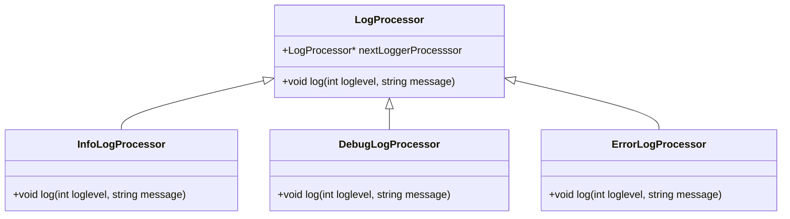
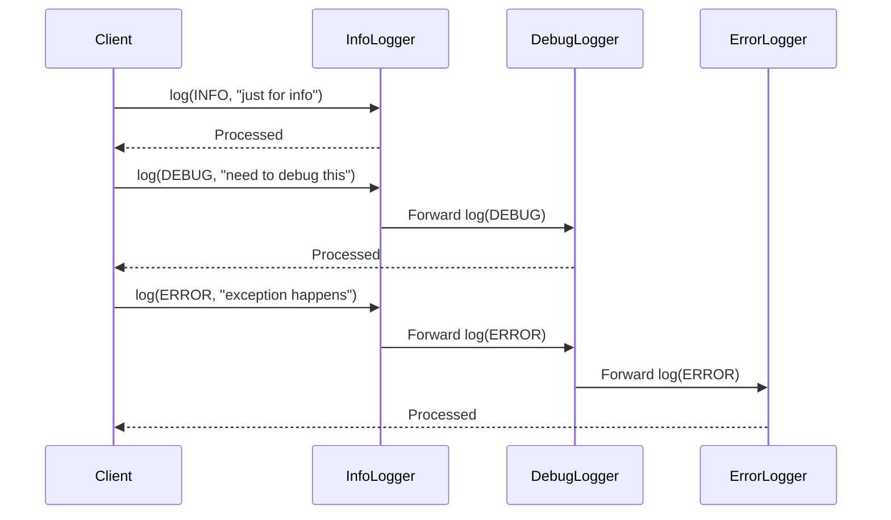

# Chain of Responsibility Pattern

## Introduction
The **Chain of Responsibility** pattern is a behavioral design pattern that allows multiple objects to handle a request without the sender knowing which object will handle it. Instead of having a single handler, the request passes through a chain of handlers, where each handler decides either to process the request or pass it to the next handler in the chain.

This pattern promotes loose coupling and enhances flexibility by allowing dynamic modifications to the chain of responsibility.

## Example: Logging System
In the provided C++ code, the Chain of Responsibility pattern is used to design a logging system that processes different levels of logs (`INFO`, `DEBUG`, `ERROR`). The logs are passed through a chain of handlers where each handler decides whether to process the log or forward it to the next handler.

### **Classes and Their Responsibilities:**
1. **`LogProcessor` (Abstract Class)**: The base class that defines an interface for handling logs. It maintains a pointer to the next logger in the chain and forwards the log if the current handler does not process it.
2. **`InfoLogProcessor` (Concrete Class)**: Handles `INFO` level logs.
3. **`DebugLogProcessor` (Concrete Class)**: Handles `DEBUG` level logs.
4. **`ErrorLogProcessor` (Concrete Class)**: Handles `ERROR` level logs.

## Code Implementation
```cpp
#include <bits/stdc++.h>
using namespace std;

class LogProcessor
{
public:
    const static int INFO = 1;
    const static int DEBUG = 2;
    const static int ERROR = 3;

    LogProcessor *nextLoggerProcesssor;

    LogProcessor(LogProcessor *loggerProcessor)
    {
        this->nextLoggerProcesssor = loggerProcessor;
    }

    virtual void log(int loglevel, string message)
    {
        if (nextLoggerProcesssor)
        {
            nextLoggerProcesssor->log(loglevel, message);
        }
    }
};

class InfoLogProccessor : public LogProcessor
{
public:
    InfoLogProccessor(LogProcessor *nextLogProcessor) : LogProcessor(nextLogProcessor)
    {
    }

    void log(int loglevel, string message) override
    {
        if (loglevel == INFO)
        {
            cout << "INFO : " << message << endl;
        }
        else
        {
            LogProcessor ::log(loglevel, message);
        }
    }
};

class DebugLogProccessor : public LogProcessor
{
public:
    DebugLogProccessor(LogProcessor *nextLogProcessor) : LogProcessor(nextLogProcessor) {}

    void log(int loglevel, string message) override
    {
        if (loglevel == DEBUG)
            cout << "DEBUG : " << message << endl;
        else
            LogProcessor ::log(loglevel, message);
    }
};

class ErrorLogProcessor : public LogProcessor
{
public:
    ErrorLogProcessor(LogProcessor *nextLogProcessor) : LogProcessor(nextLogProcessor) {}

    void log(int loglevel, string message) override
    {
        if (loglevel == ERROR)
            cout << "ERROR : " << message << endl;
        else
            LogProcessor ::log(loglevel, message);
    }
};

int main()
{
    LogProcessor *logger = new InfoLogProccessor(new DebugLogProccessor(new ErrorLogProcessor(NULL)));

    logger->log(LogProcessor::ERROR, "exception happens");
    logger->log(LogProcessor::DEBUG, "need to debug this");
    logger->log(LogProcessor::INFO, "just for info");

    return 0;
}
```

## **UML Diagram**



## **Flow Diagram**



## **Execution Flow**
1. The `main` function creates a logging chain in the following order:
   - `InfoLogProcessor -> DebugLogProcessor -> ErrorLogProcessor`
2. When `logger->log(LogProcessor::INFO, "just for info")` is called, `InfoLogProcessor` processes it.
3. When `logger->log(LogProcessor::DEBUG, "need to debug this")` is called, `InfoLogProcessor` passes it to `DebugLogProcessor`, which processes it.
4. When `logger->log(LogProcessor::ERROR, "exception happens")` is called, it passes through `InfoLogProcessor` and `DebugLogProcessor` to `ErrorLogProcessor`, which processes it.

## **Advantages of Chain of Responsibility Pattern**
- **Decouples sender and receiver**: The sender does not need to know which object will handle the request.
- **Flexible request handling**: New handlers can be added or removed dynamically.
- **Follows the Open-Closed Principle**: New handlers can be introduced without modifying existing code.

## **Conclusion**
The Chain of Responsibility pattern provides a flexible way to handle different types of log messages without tightly coupling the request sender to the handler. The above implementation demonstrates how logs are processed by different handlers in a sequential manner, making it a perfect fit for applications like ATM machines, vending machines, and logging frameworks.

