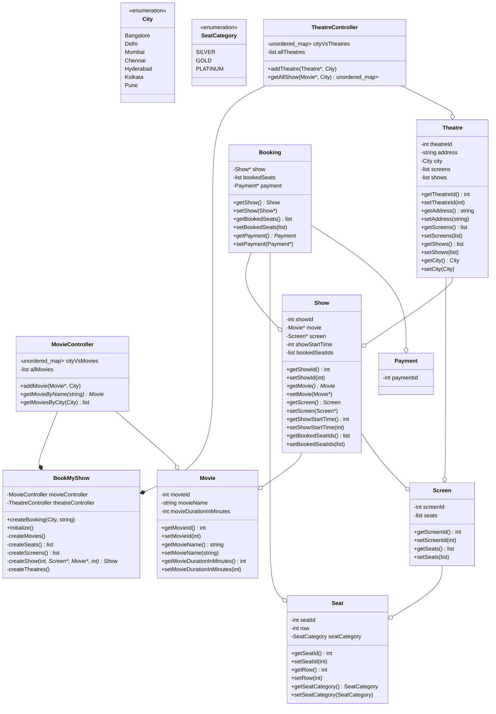
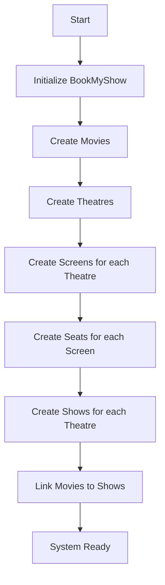
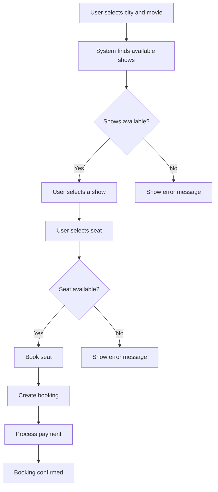
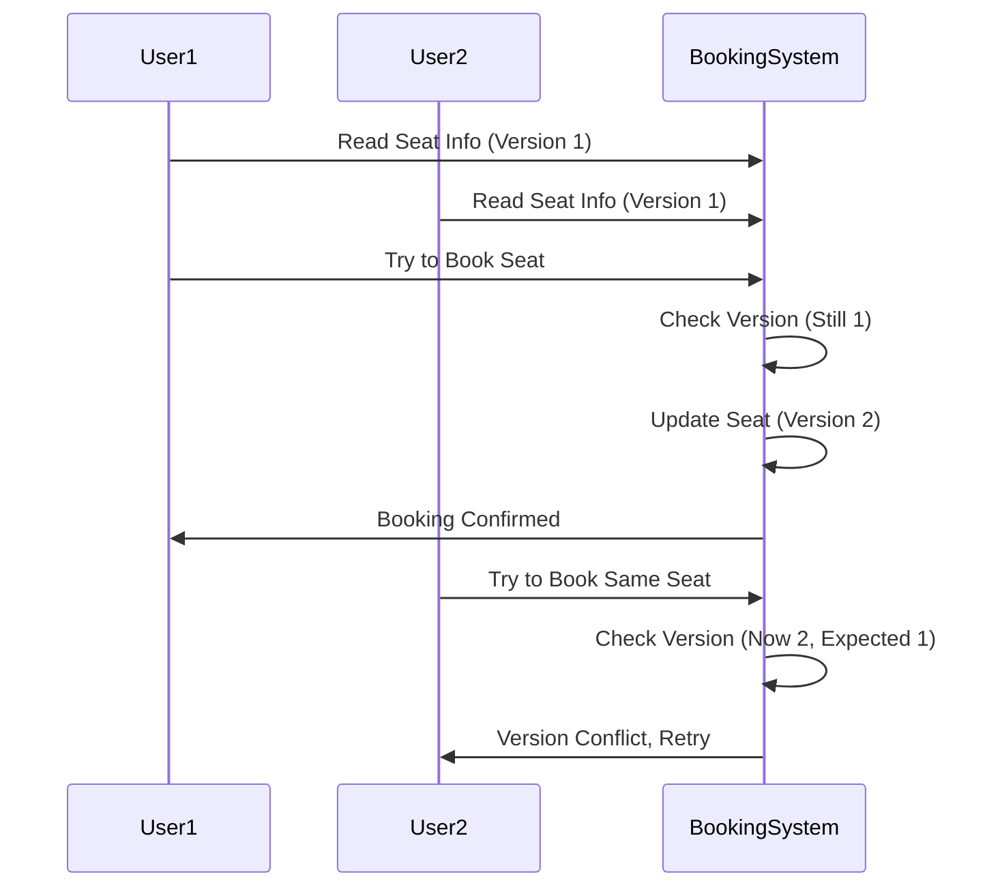
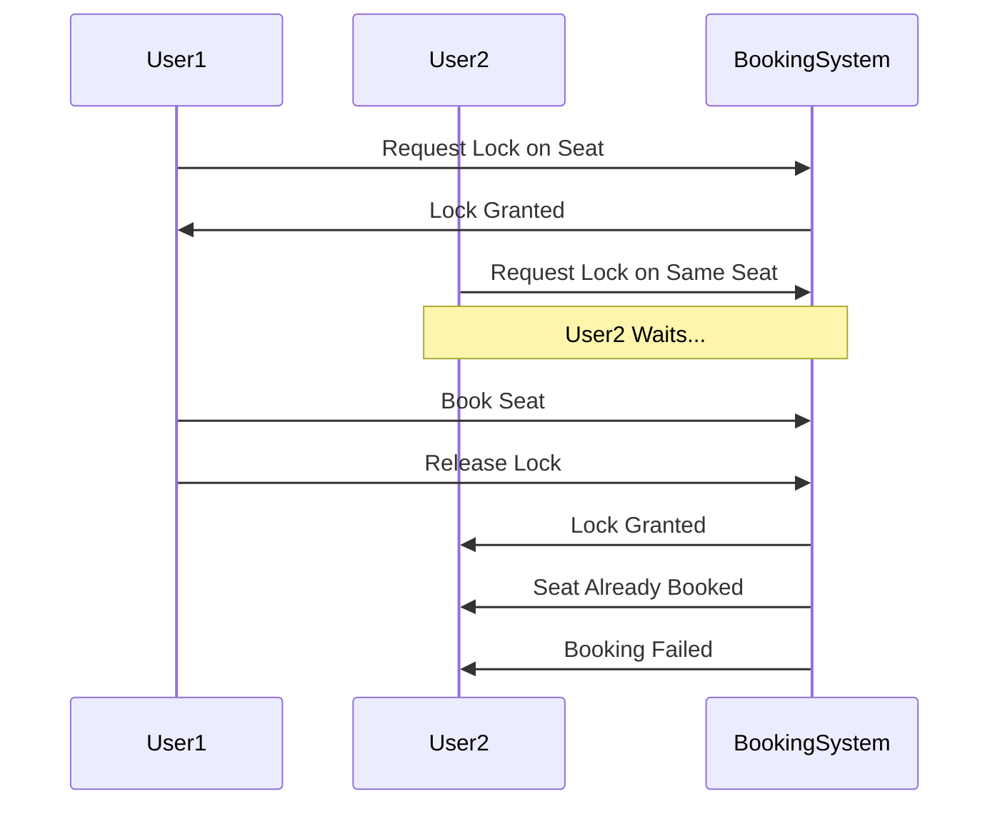

# BookMyShow Low-Level Design Documentation

This document explains the low-level design of a BookMyShow-like movie ticket booking system, based on the provided code implementation.

## System Overview

The BookMyShow system allows users to:
- Browse movies playing in their city
- View shows for a selected movie across theaters
- Book seats for a specific show
- Complete the booking process

## Class Structure

The system is designed with the following key classes:

1. **Movie**: Represents a movie with attributes like ID, name, and duration
2. **Theatre**: Represents a cinema hall with screens
3. **Screen**: Represents a movie screen within a theatre
4. **Seat**: Represents individual seats in a screen
5. **Show**: Represents a movie screening at a specific time
6. **Booking**: Represents a user's ticket booking
7. **Payment**: Handles payment for bookings
8. **Controllers**: Manage operations for movies and theatres
9. **BookMyShow**: Main class that coordinates the entire system

## UML Class Diagram



## Relationships Between Classes

1. **Movie and MovieController**:
   - MovieController manages movies and their availability in different cities
   - It maintains a catalog of all movies and provides lookup functionality

2. **Theatre and TheatreController**:
   - TheatreController manages theatres and their availability in different cities
   - It provides functionality to find shows for a specific movie in a city

3. **Theatre, Screen, and Show**:
   - A Theatre has multiple Screens
   - Each Screen can host multiple Shows
   - A Show associates a Movie with a Screen at a specific time

4. **Screen and Seat**:
   - A Screen contains multiple Seats
   - Seats are categorized (SILVER, GOLD, PLATINUM)

5. **Booking, Show, and Seat**:
   - A Booking associates booked Seats with a specific Show
   - It also includes Payment information

## System Flow

### Initialization Flow



### Booking Flow



## Concurrency Control

In a real-world booking system like BookMyShow, handling concurrent booking requests is critical. Multiple users might try to book the same seats simultaneously, leading to race conditions. The system needs concurrency control mechanisms to manage these situations. Two common approaches are optimistic and pessimistic locking.

### Optimistic Locking

Optimistic locking assumes conflicts are rare and allows transactions to proceed without locking resources. It verifies at commit time that no conflicts occurred.



#### Implementation in BookMyShow

To implement optimistic locking in the BookMyShow system, we could modify the `Show` class:

```cpp
class Show {
public:
    // Existing attributes
    int version; // Version counter for optimistic locking
    
    bool tryBookSeat(int seatId, int expectedVersion) {
        if (version != expectedVersion) {
            return false; // Version conflict, booking failed
        }
        
        // Check if seat is already booked
        if (find(bookedSeatIds.begin(), bookedSeatIds.end(), seatId) != bookedSeatIds.end()) {
            return false;
        }
        
        // Book the seat and increment version
        bookedSeatIds.push_back(seatId);
        version++;
        return true;
    }
};
```

### Pessimistic Locking

Pessimistic locking assumes conflicts are likely and blocks access to resources by acquiring locks before performing operations.



#### Implementation in BookMyShow

For pessimistic locking, we could modify the system as follows:

```cpp
class ShowLockManager {
private:
    unordered_map<int, mutex> showLocks; // Show ID to mutex mapping
    
public:
    void lockShow(int showId) {
        showLocks[showId].lock();
    }
    
    void unlockShow(int showId) {
        showLocks[showId].unlock();
    }
};

// In BookMyShow class
void BookMyShow::createBooking(City userCity, string movieName) {
    // Find show as before
    
    // Lock the show before checking seat availability
    showLockManager.lockShow(interestedShow->getShowId());
    
    try {
        list<int> bookedSeats = interestedShow->getBookedSeatIds();
        if (find(bookedSeats.begin(), bookedSeats.end(), seatNumber) == bookedSeats.end()) {
            // Book the seat as before
        } else {
            // Seat already booked
        }
    } finally {
        // Always release the lock
        showLockManager.unlockShow(interestedShow->getShowId());
    }
}
```

### Comparison: Optimistic vs Pessimistic Locking

```mermaid
graph TD
    subgraph Optimistic Locking
        A1[Assumes conflicts are rare] --> B1[No locks during operation]
        B1 --> C1[Version check at commit time]
        C1 --> D1[If conflict, retry or fail]
        D1 --> E1[High throughput when conflicts rare]
    end
    
    subgraph Pessimistic Locking
        A2[Assumes conflicts are common] --> B2[Acquires locks before operation]
        B2 --> C2[Blocks other transactions]
        C2 --> D2[Releases locks after completion]
        D2 --> E2[Ensures consistency but may reduce throughput]
    end
```



### When to Use Each Approach

1. **Optimistic Locking**:
   - Best for read-heavy systems
   - Good when conflicts are rare
   - Works well when transactions are short
   - Better throughput in low-contention scenarios

2. **Pessimistic Locking**:
   - Best for write-heavy systems
   - Good when conflicts are frequent
   - Better when transactions are long-running
   - Prevents wasted work from retries

### Recommendation for BookMyShow

For a ticket booking system like BookMyShow, a hybrid approach might be ideal:

1. Use **optimistic locking** for browsing movies and shows (read-heavy operations)
2. Use **pessimistic locking** for seat selection and booking (critical write operations)

In high-demand scenarios (like opening day of a popular movie), pessimistic locking at the seat level would help prevent overbooking, while optimistic locking could be used for other parts of the system to maintain high throughput.

## Code Explanation

### 1. Model Classes

The system has several model classes representing the core entities:

#### Movie Class
Represents a movie with id, name, and duration.

```cpp
class Movie {
public:
    int movieId;
    string movieName;
    int movieDurationInMinutes;
    // getters and setters
};
```

#### Seat Class
Represents a seat in a screen with id, row, and category.

```cpp
class Seat {
public:
    int seatId;
    int row;
    SeatCategory seatCategory;
    // getters and setters
};
```

#### Screen Class
Represents a screen in a theatre with multiple seats.

```cpp
class Screen {
public:
    int screenId;
    list<Seat*> seats;
    // getters and setters
};
```

#### Show Class
Represents a movie screening at a specific time on a specific screen.

```cpp
class Show {
public:
    int showId;
    Movie* movie;
    Screen* screen;
    int showStartTime;
    list<int> bookedSeatIds;
    // getters and setters
};
```

#### Theatre Class
Represents a cinema hall with multiple screens and shows.

```cpp
class Theatre {
public:
    int theatreId;
    string address;
    City city;
    list<Screen*> screens;
    list<Show*> shows;
    // getters and setters
};
```

#### Booking Class
Represents a user's booking of seats for a show.

```cpp
class Booking {
public:
    Show* show;
    list<Seat*> bookedSeats;
    Payment* payment;
    // getters and setters
};
```

### 2. Controller Classes

The system uses controller classes to manage the model objects:

#### MovieController
Manages movies and their availability across cities.

```cpp
class MovieController {
public:
    unordered_map<City,list<Movie*>> cityVsMovies;
    list<Movie*> allMovies;
    // methods to add and retrieve movies
};
```

#### TheatreController
Manages theatres and provides show information.

```cpp
class TheatreController {
public:
    unordered_map<City,list<Theatre*>> cityVsTheatres;
    list<Theatre*> allTheatres;
    // methods to add theatres and get shows
};
```

### 3. Main Application Class

The `BookMyShow` class ties everything together:

```cpp
class BookMyShow {
public:
    MovieController movieController;
    TheatreController theatreController;
    
    void createBooking(City userCity, string movieName);
    void initialize();
    // helper methods for initialization
};
```

## Data Flow

1. **Initialization**:
   - System creates movies using `createMovies()`
   - System creates theatres with screens and seats using `createTheatres()`
   - Movies are assigned to shows in specific theatres

2. **Movie Lookup**:
   - User specifies a city and movie name
   - System uses `MovieController` to find the movie
   - If movie exists, system proceeds; otherwise, it shows an error

3. **Show Lookup**:
   - System uses `TheatreController` to find shows for the selected movie in the specified city
   - If shows exist, system proceeds; otherwise, it shows an error

4. **Seat Booking**:
   - System selects a seat (hardcoded as seat #30 in the provided code)
   - System checks if seat is available
   - If available, system books the seat; otherwise, it shows an error

5. **Booking Confirmation**:
   - System creates a booking object linking the show and booked seats
   - In a real system, payment would be processed here
   - Booking confirmation is displayed

## Design Patterns Used

1. **Singleton Pattern**: The `BookMyShow` class behaves like a singleton that coordinates the entire system.

2. **Factory Method Pattern**: Methods like `createSeats()`, `createScreens()`, and `createShow()` act as factory methods creating objects.

3. **MVC Pattern**: The system separates data (model classes), controllers, and the main application logic.

## Limitations and Improvements

1. **User Management**: There's no user management system to track bookings for specific users.

2. **Payment Processing**: Payment is represented but not implemented.

3. **Seat Selection**: Seat selection is hardcoded instead of allowing user choice.

4. **Concurrency Control**: The current implementation lacks mechanisms to handle concurrent bookings, which could be addressed by adding optimistic or pessimistic locking as described in the concurrency section.

5. **Error Handling**: Error handling is minimal, with simple console messages.

## Conclusion

The provided BookMyShow design demonstrates a classic object-oriented approach to building a ticket booking system. It separates concerns between different components, uses controllers to manage data, and implements a clean flow for the booking process. The design could be enhanced by addressing the limitations mentioned above, particularly by implementing a robust concurrency control mechanism, but it provides a solid foundation for a movie ticket booking system.
