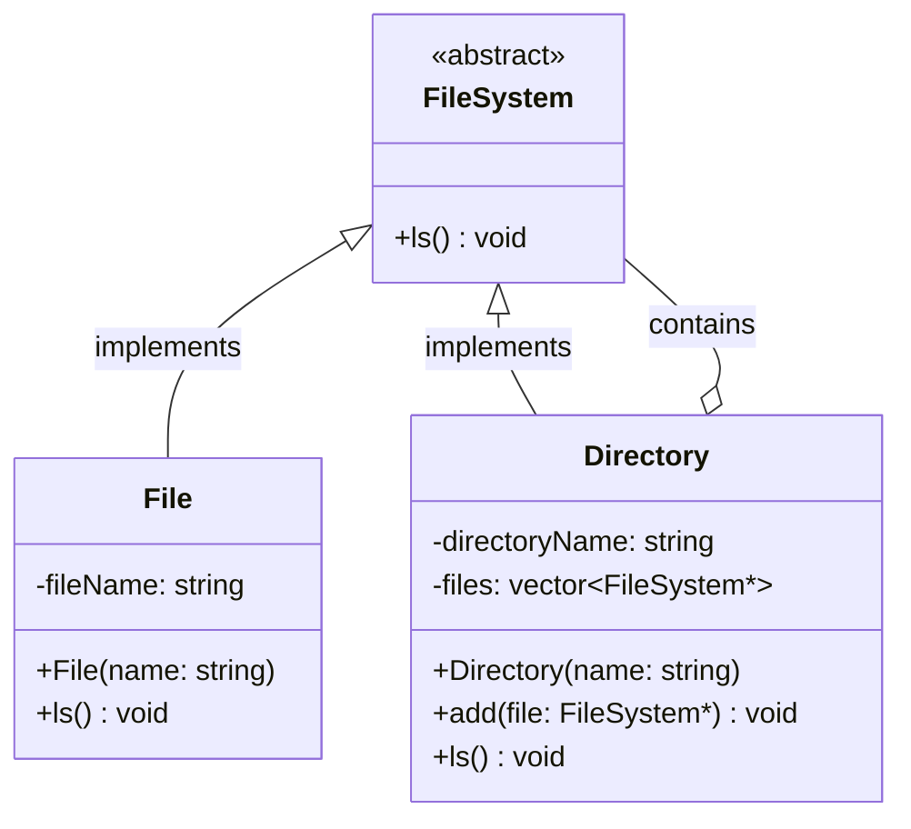
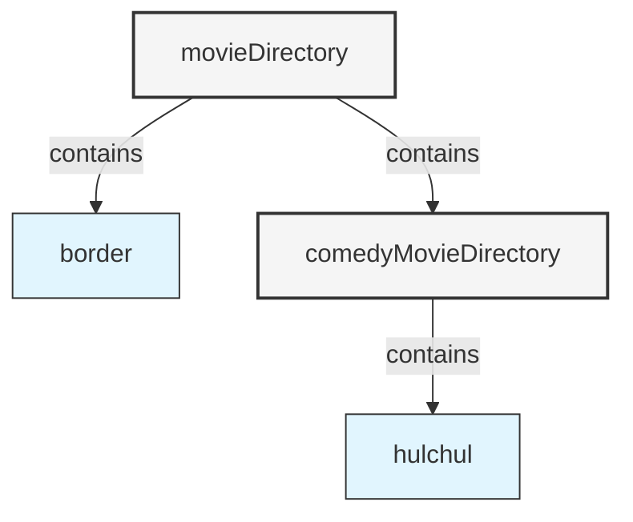
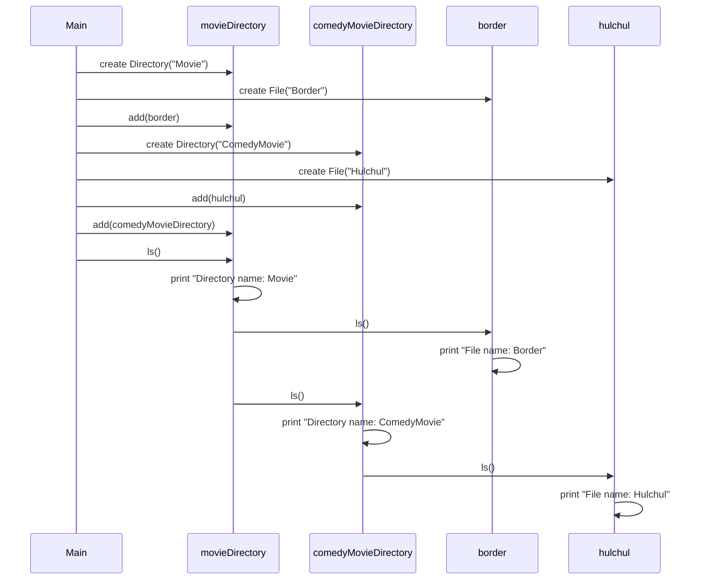

# Composite Design Pattern - File System Example

## Introduction

The Composite Design Pattern is a structural design pattern that lets you compose objects into tree structures to represent part-whole hierarchies. It allows clients to treat individual objects and compositions of objects uniformly.

This README explains the Composite pattern using a file system implementation example, where both files (individual objects) and directories (composite objects containing other items) can be treated through a common interface.

## Core Components of the Composite Pattern

1. **Component** (Abstract base class/interface) - Declares the interface for objects in the composition
2. **Leaf** (Primitive object) - Represents individual objects with no children
3. **Composite** (Container object) - Represents complex objects that can contain children

## UML Class Diagram



## Implementation Details

### 1. Component (FileSystem)

`FileSystem.hpp` defines the abstract base class with a common interface:

```cpp
class FileSystem {
public:
    virtual void ls() = 0; // Pure virtual function
};
```

This abstract class serves as the unified interface for both individual files and directory objects, allowing them to be treated uniformly.

### 2. Leaf (File)

`File.hpp` implements the leaf node:

```cpp
class File : public FileSystem {
public:
    string fileName;
    
    File(string name) {
        this->fileName = name;
    }
    
    void ls() override {
        cout << "File name : " << this->fileName << endl;
    }
};
```

File is a simple object that represents a leaf node - it has no children and implements the `ls()` operation directly.

### 3. Composite (Directory)

`Directory.hpp` implements the composite node:

```cpp
class Directory : public FileSystem {
public:
    string directoryName;
    vector<FileSystem*> files;
    
    Directory(string name) {
        this->directoryName = name;
        this->files = vector<FileSystem*>();
    }
    
    void add(FileSystem* file) {
        this->files.push_back(file);
    }
    
    void ls() override {
        cout << "Directory name : " << this->directoryName << endl;
        
        for(auto file : files) {
            file->ls();
        }
    }
};
```

Directory is a composite object that can contain other FileSystem objects (both Files and other Directories). It maintains a collection of children and implements operations that typically delegate work to child components.

## Object Composition Flow Diagram



## Execution Flow Diagram



## Key Benefits of the Composite Pattern

1. **Uniformity**: Clients can treat composite structures and individual objects uniformly through the common interface.
2. **Recursive Structure**: The pattern naturally models hierarchical structures where both containers and content implement the same interface.
3. **Extensibility**: New component types can be added without changing existing code.
4. **Simplified Client Code**: Client code doesn't need different logic to handle leaf nodes versus composite nodes.

## Implementation in Our Example

In our file system example:
- `FileSystem` is the Component interface (abstract class)
- `File` is the Leaf class representing individual files
- `Directory` is the Composite class that can contain both Files and other Directories

The `main.cpp` demonstrates how to build a tree structure:
1. Create a root directory "Movie"
2. Add a file "Border" to it
3. Create a subdirectory "ComedyMovie"
4. Add a file "Hulchul" to the subdirectory
5. Add the subdirectory to the root directory
6. Call the `ls()` operation on the root to recursively display the entire structure

## Output

```
Directory name : Movie
File name : Border
Directory name : ComedyMovie
File name : Hulchul
```

## Real-world Applications

The Composite Pattern is widely used in:
- File systems (as demonstrated in this example)
- Graphics rendering systems
- Document structures
- Organization hierarchies
- GUI component hierarchies
- Menu systems

## Conclusion

The Composite Design Pattern provides an elegant way to represent hierarchical structures while ensuring individual and composite objects can be treated uniformly. In our file system example, both files and directories implement the same `FileSystem` interface, allowing them to be operated on uniformly despite their different internal implementations.
