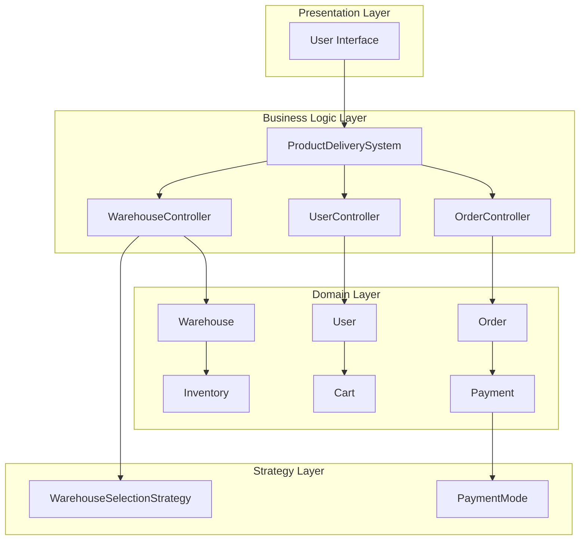
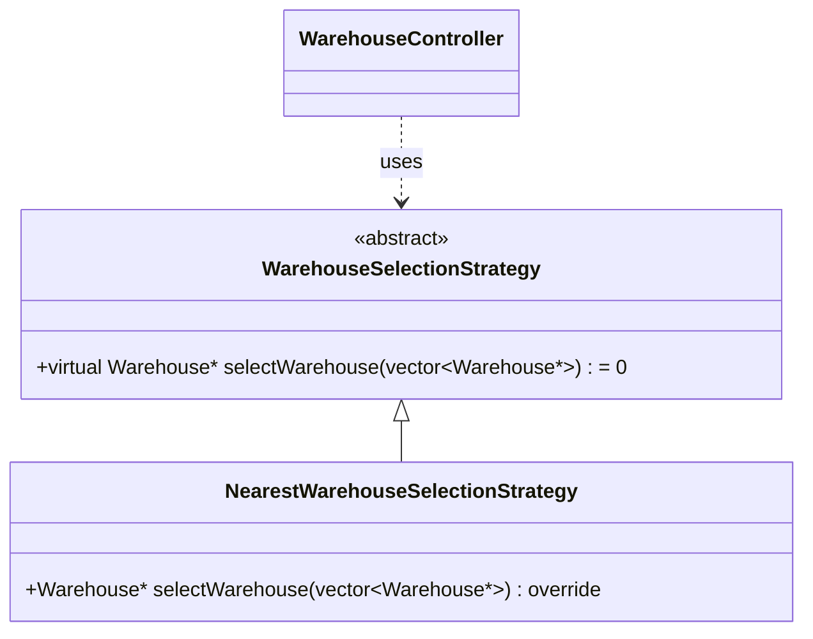
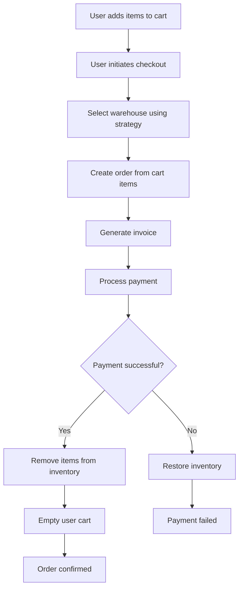
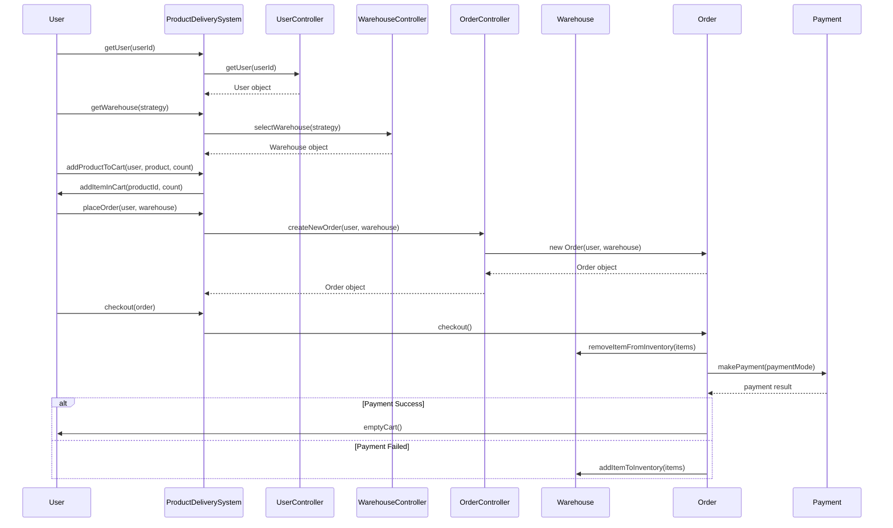
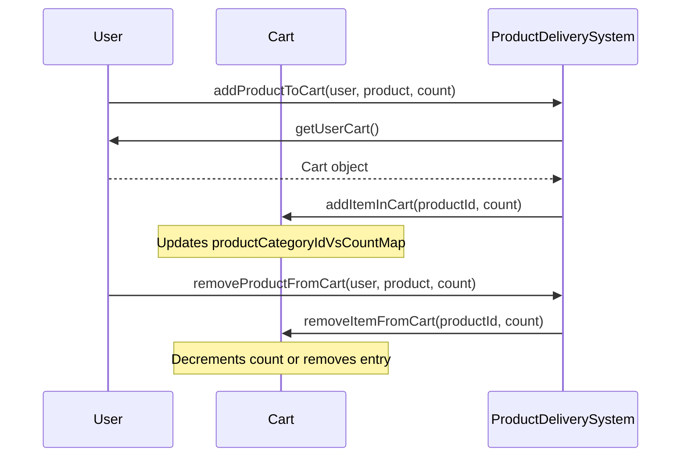
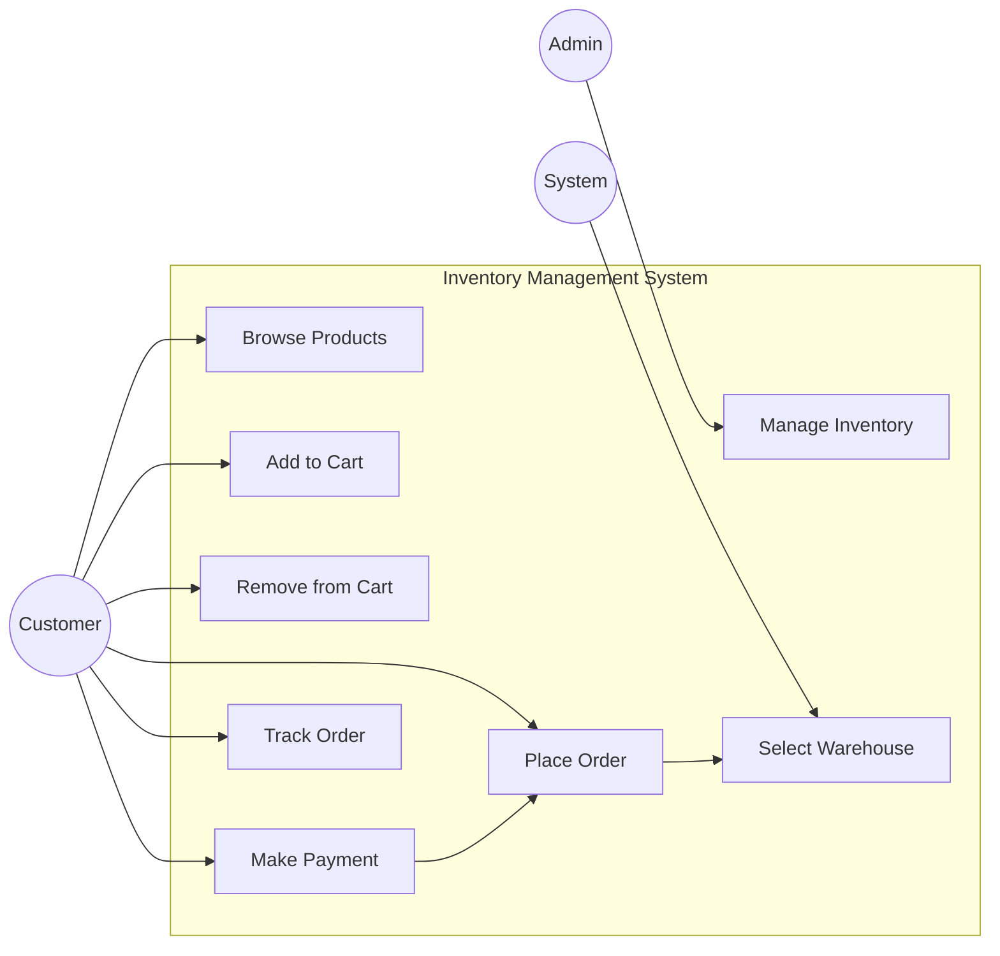
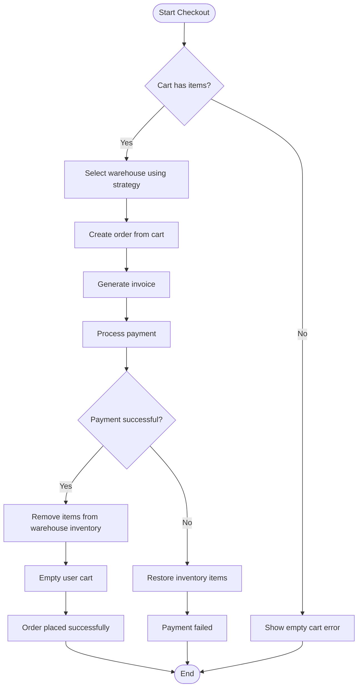
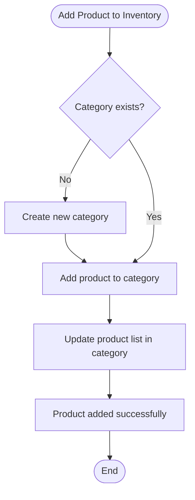

# Inventory Management System (Zepto-style) - Low Level Design

## Table of Contents
1. [System Overview](#system-overview)
2. [Architecture](#architecture)
3. [Class Diagrams](#class-diagrams)
4. [Design Patterns](#design-patterns)
5. [Data Flow](#data-flow)
6. [Sequence Diagrams](#sequence-diagrams)
7. [Use Case Diagram](#use-case-diagram)
8. [Activity Diagrams](#activity-diagrams)
9. [Code Analysis](#code-analysis)
10. [Improvements & Recommendations](#improvements--recommendations)

## System Overview

This is a **Low Level Design (LLD)** implementation of an **Inventory Management System** similar to platforms like Zepto, focusing on rapid delivery services. The system handles:

- **User Management**: User registration, cart management
- **Inventory Management**: Product categories, stock management
- **Warehouse Operations**: Multiple warehouses with selection strategies
- **Order Processing**: Cart to order conversion, payment processing
- **Delivery System**: Order fulfillment and tracking

### Key Features
- Multi-warehouse support with selection strategies
- Real-time inventory management
- Payment processing with multiple modes
- Cart management with add/remove operations
- Order lifecycle management

## Architecture

### High-Level Architecture



## Class Diagrams

### Core Domain Classes

```mermaid
classDiagram
    class User {
        +int userId
        +string userName
        +Address* address
        +Cart* userCartDetails
        +vector~int~ orderIds
        +User()
        +Cart* getUserCart()
    }
    
    class Address {
        +int pinCode
        +string city
        +string state
        +Address(int, string, string)
        +int getPinCode()
        +void setPinCode(int)
        +string getCity()
        +void setCity(string)
        +string getState()
        +void setState(string)
    }
    
    class Cart {
        +unordered_map~int,int~ productCategoryIdVsCountMap
        +Cart()
        +void addItemInCart(int, int)
        +void removeItemFromCart(int, int)
        +void emptyCart()
        +unordered_map~int,int~ getCartItems()
    }
    
    class Warehouse {
        +Inventory* inventory
        +Address* address
        +void removeItemFromInventory(unordered_map~int,int~)
        +void addItemToInventory(unordered_map~int,int~)
    }
    
    class Inventory {
        +vector~ProductCategory*~ productCategoryList
        +Inventory()
        +void addCategory(int, string, int)
        +void addProduct(Product*, int)
        +void removeItems(unordered_map~int,int~)
        -ProductCategory* getProductCategoryFromID(int)
    }
    
    class ProductCategory {
        +int productCategoryId
        +string categoryName
        +vector~Product*~ products
        +double price
        +void addProduct(Product*)
        +void removeProduct(int)
    }
    
    class Product {
        +int productId
        +string productName
    }
    
    User ||--|| Address : has
    User ||--|| Cart : owns
    Warehouse ||--|| Inventory : contains
    Warehouse ||--|| Address : located_at
    Inventory ||--o{ ProductCategory : manages
    ProductCategory ||--o{ Product : contains
```

### Order Processing Classes

```mermaid
classDiagram
    class Order {
        +User* user
        +Address* deliveryAddress
        +unordered_map~int,int~ productCategoryAndCountMap
        +Warehouse* warehouse
        +Invoice* invoice
        +Payment* payment
        +OrderStatus* orderStatus
        +Order(User*, Warehouse*)
        +void checkout()
        +bool makePayment(PaymentMode*)
        +void generateOrderInvoice()
    }
    
    class Invoice {
        +int totalItemPrice
        +int totalTax
        +int totalFinalPrice
        +void generateInvoice(Order*)
    }
    
    class Payment {
        +PaymentMode* paymentMode
        +Payment(PaymentMode*)
        +bool makePayment()
    }
    
    class PaymentMode {
        <<abstract>>
        +virtual bool makePayment() = 0
    }
    
    class UPIPaymentMode {
        +bool makePayment() override
    }
    
    class CardPaymentMode {
        +bool makePayment() override
    }
    
    class OrderStatus {
        <<enumeration>>
        DELIVERED
        CANCELLED
        RETURNED
        UNDELIVERED
    }
    
    Order ||--|| Invoice : generates
    Order ||--|| Payment : processes
    Order ||--|| OrderStatus : has
    Payment ||--|| PaymentMode : uses
    PaymentMode <|-- UPIPaymentMode
    PaymentMode <|-- CardPaymentMode
```

### Controller Classes

```mermaid
classDiagram
    class ProductDeliverySystem {
        +UserController* userController
        +WarehouseController* warehouseController
        +OrderController* orderController
        +ProductDeliverySystem(vector~User*~, vector~Warehouse*~)
        +User* getUser(int)
        +Warehouse* getWarehouse(WarehouseSelectionStrategy*)
        +Inventory* getInventory(Warehouse*)
        +void addProductToCart(User*, ProductCategory*, int)
        +Order* placeOrder(User*, Warehouse*)
        +void checkout(Order*)
    }
    
    class UserController {
        +vector~User*~ userList
        +UserController(vector~User*~)
        +void addUser(User*)
        +void removeUser(User*)
        +User* getUser(int)
    }
    
    class WarehouseController {
        +vector~Warehouse*~ warehouseList
        +WarehouseSelectionStrategy* warehouseSelectionStrategy
        +WarehouseController(vector~Warehouse*~, WarehouseSelectionStrategy*)
        +void addNewWarehouse(Warehouse*)
        +void removeWarehouse(Warehouse*)
        +Warehouse* selectWarehouse(WarehouseSelectionStrategy*)
    }
    
    class OrderController {
        +vector~Order*~ orderList
        +unordered_map~int,vector~Order*~~ userIDVsOrders
        +OrderController()
        +Order* createNewOrder(User*, Warehouse*)
        +void removeOrder(Order*)
        +vector~Order*~ getOrderByCustomerId(int)
        +Order* getOrderByOrderId(int)
    }
    
    ProductDeliverySystem ||--|| UserController : manages
    ProductDeliverySystem ||--|| WarehouseController : manages  
    ProductDeliverySystem ||--|| OrderController : manages
```

### Strategy Pattern Implementation



## Design Patterns

### 1. Strategy Pattern
- **WarehouseSelectionStrategy**: Allows different warehouse selection algorithms
- **PaymentMode**: Supports multiple payment methods (UPI, Card)

### 2. Factory Pattern (Implicit)
- Controllers act as factories for creating domain objects

### 3. Facade Pattern
- **ProductDeliverySystem** acts as a facade providing simplified interface to complex subsystems

### 4. Composition Pattern
- User owns Cart, Address
- Warehouse contains Inventory
- Order aggregates multiple components

## Data Flow

### Order Processing Flow



## Sequence Diagrams

### Order Placement Sequence



### Cart Management Sequence



## Use Case Diagram



## Activity Diagrams

### Checkout Process Activity Diagram



### Inventory Management Activity Diagram



## Code Analysis

### Key Components Analysis

#### 1. **ProductDeliverySystem (Facade)**
```cpp
class ProductDeliverySystem {
    // Acts as central coordinator
    // Simplifies complex operations
    // Provides unified interface
}
```

**Strengths:**
- Clean separation of concerns
- Single entry point for operations
- Abstracts complexity from clients

**Issues:**
- Could become a God object if not managed properly

#### 2. **Cart Implementation**
```cpp
unordered_map<int, int> productCategoryIdVsCountMap;
```

**Strengths:**
- Efficient O(1) lookup and updates
- Simple quantity management

**Issues:**
- No validation for negative quantities
- Method name typo: `remoteItemFromCart` should be `removeItemFromCart`

#### 3. **Strategy Pattern Implementation**
```cpp
class WarehouseSelectionStrategy {
    virtual Warehouse* selectWarehouse(vector<Warehouse*>& warehouseList) = 0;
};
```

**Strengths:**
- Flexible warehouse selection algorithms
- Easy to extend with new strategies

**Issues:**
- Current implementation just returns first warehouse
- No consideration of distance, capacity, or availability

#### 4. **Payment Processing**
```cpp
class PaymentMode {
    virtual bool makePayment() = 0;
};
```

**Strengths:**
- Extensible payment methods
- Simple interface

**Issues:**
- No error handling or detailed response
- Missing transaction details
- No validation

### Memory Management Concerns

The code uses raw pointers extensively:
```cpp
User* user = new User();
Warehouse* warehouse = new Warehouse();
```

**Issues:**
- Potential memory leaks
- No RAII (Resource Acquisition Is Initialization)
- Manual memory management required

**Recommendations:**
- Use smart pointers (`std::unique_ptr`, `std::shared_ptr`)
- Implement proper destructors
- Consider RAII principles

### Data Consistency Issues

#### Order Creation Process:
```cpp
Order(User* user, Warehouse* warehouse) {
    this->productCategoryAndCountMap = user->getUserCart()->getCartItems();
    // Items copied but no inventory validation
}
```

**Issues:**
- No validation if warehouse has sufficient inventory
- Race conditions possible in multi-threaded environment
- No atomicity in order operations

## Improvements & Recommendations

### 1. **Memory Management**
```cpp
// Instead of raw pointers
User* user = new User();

// Use smart pointers
std::unique_ptr<User> user = std::make_unique<User>();
```

### 2. **Error Handling**
```cpp
class OrderResult {
    bool success;
    string errorMessage;
    Order* order;
};

OrderResult placeOrder(User* user, Warehouse* warehouse);
```

### 3. **Inventory Validation**
```cpp
bool validateInventoryAvailability(
    Warehouse* warehouse, 
    const unordered_map<int,int>& items
);
```

### 4. **Thread Safety**
```cpp
class ThreadSafeCart {
    mutable std::mutex cartMutex;
    unordered_map<int, int> productCategoryIdVsCountMap;
    
public:
    void addItemInCart(int productId, int count) {
        std::lock_guard<std::mutex> lock(cartMutex);
        // ... implementation
    }
};
```

### 5. **Additional Design Patterns**

#### Observer Pattern for Order Status
```cpp
class OrderObserver {
public:
    virtual void onOrderStatusChanged(Order* order, OrderStatus newStatus) = 0;
};

class NotificationService : public OrderObserver {
    void onOrderStatusChanged(Order* order, OrderStatus newStatus) override {
        // Send notifications
    }
};
```

#### Builder Pattern for Order Creation
```cpp
class OrderBuilder {
    Order* order;
public:
    OrderBuilder& setUser(User* user);
    OrderBuilder& setWarehouse(Warehouse* warehouse);
    OrderBuilder& setDeliveryAddress(Address* address);
    Order* build();
};
```

### 6. **Database Integration**
```cpp
class Repository {
public:
    virtual void save(Entity* entity) = 0;
    virtual Entity* findById(int id) = 0;
    virtual vector<Entity*> findAll() = 0;
};

class UserRepository : public Repository {
    // Database operations for User
};
```

### 7. **Configuration Management**
```cpp
class SystemConfig {
public:
    static int getMaxCartItems();
    static double getTaxRate();
    static int getDeliveryTimeoutMinutes();
};
```

### 8. **Logging and Monitoring**
```cpp
class Logger {
public:
    static void logInfo(const string& message);
    static void logError(const string& message);
    static void logWarning(const string& message);
};
```

## Conclusion

This Inventory Management System demonstrates a solid understanding of object-oriented design principles and low-level design concepts. The implementation showcases several design patterns and maintains good separation of concerns.

**Strengths:**
- Clear class responsibilities
- Effective use of design patterns
- Modular architecture
- Extensible payment and warehouse selection systems

**Areas for Improvement:**
- Memory management and resource cleanup
- Error handling and validation
- Thread safety considerations
- Performance optimizations
- Integration with persistent storage

The system provides a good foundation that can be enhanced with the recommended improvements for production use.
