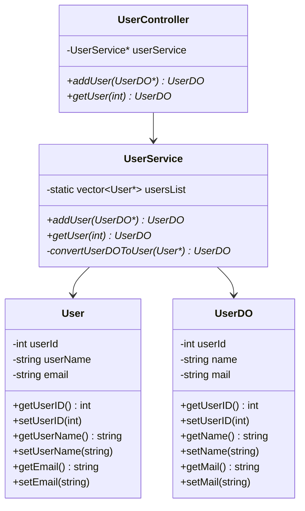
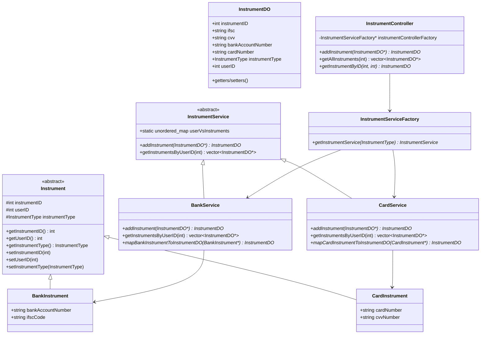
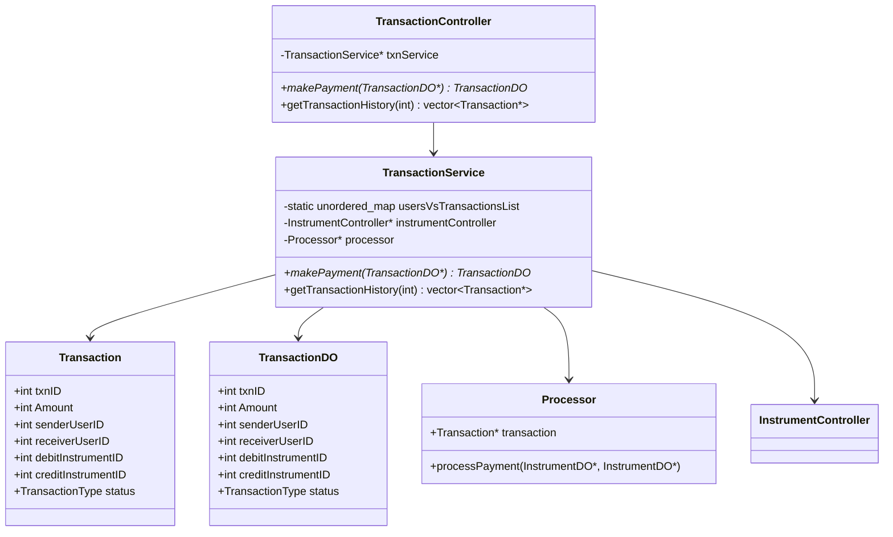
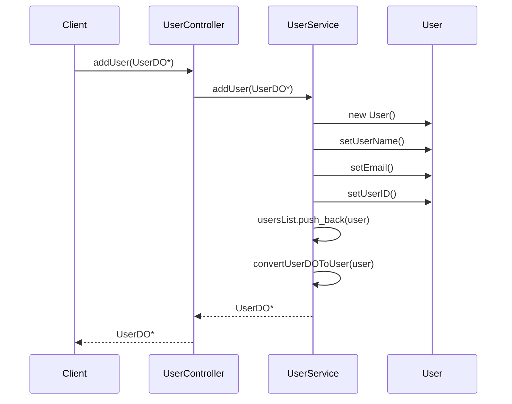
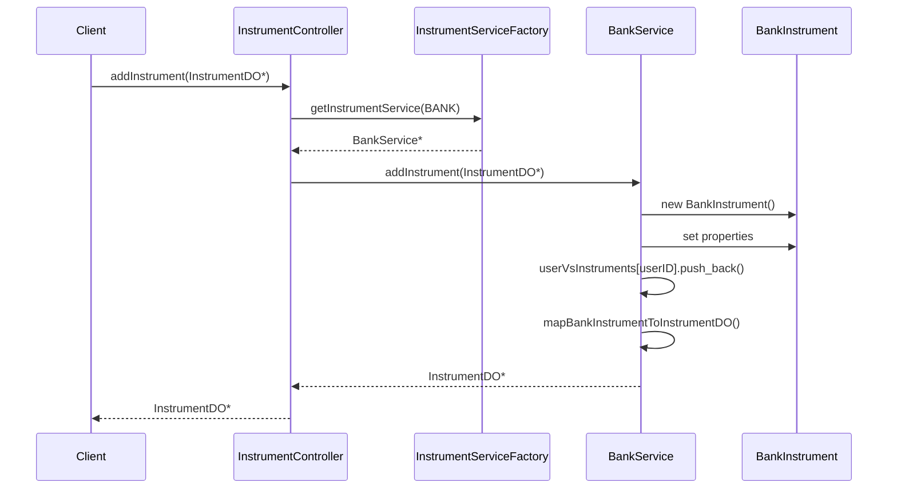
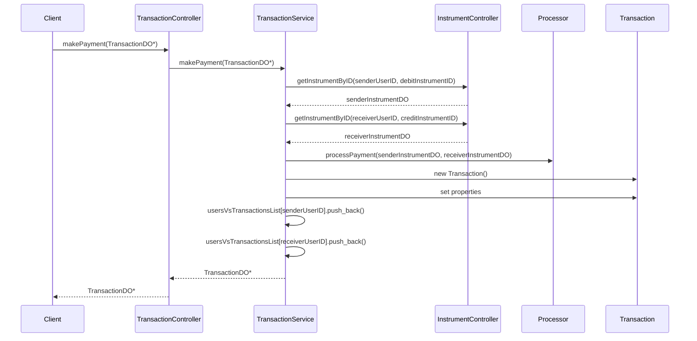
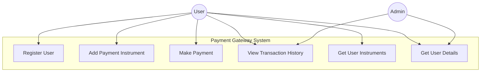
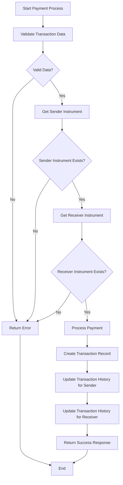
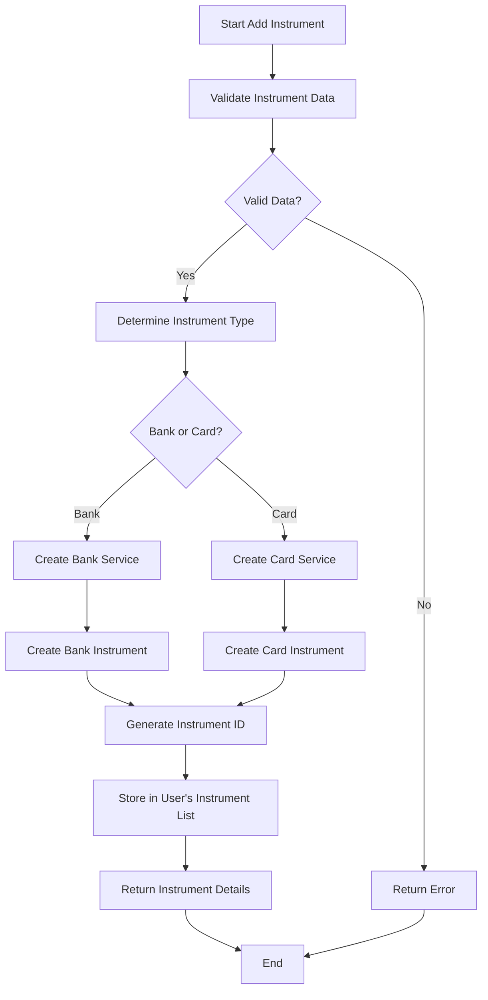
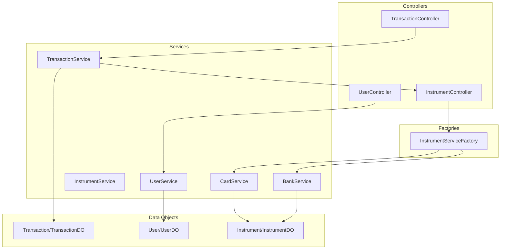

# Payment Gateway - Low Level Design (LLD)

## Table of Contents
1. [Overview](#overview)
2. [System Architecture](#system-architecture)
3. [Class Diagrams](#class-diagrams)
4. [Sequence Diagrams](#sequence-diagrams)
5. [Use Case Diagrams](#use-case-diagrams)
6. [Activity Diagrams](#activity-diagrams)
7. [Component Relationships](#component-relationships)
8. [Data Flow](#data-flow)
9. [Implementation Details](#implementation-details)
10. [Design Patterns Used](#design-patterns-used)

## Overview

This Payment Gateway system is designed using object-oriented principles to handle user management, payment instruments (Bank accounts and Cards), and transaction processing. The system follows a layered architecture with clear separation of concerns.

### Key Features
- User management (registration and retrieval)
- Multiple payment instruments support (Bank and Card)
- Transaction processing between users
- Transaction history tracking
- Factory pattern for instrument services

## System Architecture

```
┌─────────────────────────────────────────────────────────────┐
│                    PRESENTATION LAYER                       │
│                      (main.cpp)                            │
└─────────────────────┬───────────────────────────────────────┘
                      │
┌─────────────────────┴───────────────────────────────────────┐
│                   CONTROLLER LAYER                          │
│  ┌─────────────────┐ ┌──────────────────┐ ┌─────────────────┐│
│  │ UserController  │ │InstrumentController│ │TransactionController││
│  └─────────────────┘ └──────────────────┘ └─────────────────┘│
└─────────────────────┬───────────────────────────────────────┘
                      │
┌─────────────────────┴───────────────────────────────────────┐
│                   SERVICE LAYER                             │
│  ┌─────────────────┐ ┌──────────────────┐ ┌─────────────────┐│
│  │   UserService   │ │InstrumentService │ │TransactionService││
│  └─────────────────┘ │    (Abstract)    │ └─────────────────┘│
│                      │ ┌──────────────┐ │                   │
│                      │ │ BankService  │ │                   │
│                      │ │ CardService  │ │                   │
│                      │ └──────────────┘ │                   │
│                      └──────────────────┘                   │
└─────────────────────┬───────────────────────────────────────┘
                      │
┌─────────────────────┴───────────────────────────────────────┐
│                    DATA LAYER                               │
│  ┌─────────────────┐ ┌──────────────────┐ ┌─────────────────┐│
│  │      User       │ │   Instrument     │ │   Transaction   │ │
│  │    UserDO       │ │  InstrumentDO    │ │ TransactionDO   │ │
│  └─────────────────┘ └──────────────────┘ └─────────────────┘│
└─────────────────────────────────────────────────────────────┘
```

## Class Diagrams

### 1. User Management Classes



### 2. Instrument Management Classes



### 3. Transaction Management Classes



## Sequence Diagrams

### 1. User Registration Flow



### 2. Add Payment Instrument Flow



### 3. Payment Processing Flow



## Use Case Diagrams



## Activity Diagrams

### Payment Processing Activity



### Add Instrument Activity



## Component Relationships

### High-Level Component Interaction



## Data Flow

### 1. User Registration Data Flow
```
UserDO Input → UserController → UserService → User Entity → Static Storage → UserDO Output
```

### 2. Instrument Addition Data Flow
```
InstrumentDO Input → InstrumentController → InstrumentServiceFactory → 
Specific Service (Bank/Card) → Instrument Entity → Static Storage → InstrumentDO Output
```

### 3. Payment Processing Data Flow
```
TransactionDO Input → TransactionController → TransactionService → 
InstrumentController → Instrument Validation → Processor → 
Transaction Entity → Static Storage → TransactionDO Output
```

## Implementation Details

### Key Design Decisions

1. **Static Storage**: Uses static maps and vectors for data persistence
   ```cpp
   static unordered_map<int, vector<Instrument*>> userVsInstruments;
   static vector<User*> usersList;
   static unordered_map<int, vector<Transaction*>> usersVsTransactionsList;
   ```

2. **Factory Pattern**: InstrumentServiceFactory creates appropriate service instances
   ```cpp
   InstrumentService* getInstrumentService(InstrumentType instrumentType) {
       if(instrumentType == InstrumentType::BANK) {
           return new BankService();
       }
       else if(instrumentType == InstrumentType::CARD) {
           return new CardService();
       }
       return NULL;
   }
   ```

3. **Polymorphism**: Abstract InstrumentService with concrete implementations
   ```cpp
   class InstrumentService {
   public:
       virtual InstrumentDO* addInstrument(InstrumentDO* instrumentDO) = 0;
       virtual vector<InstrumentDO*> getInstrumentsByUserID(int userID) = 0;
   };
   ```

4. **Data Transfer Objects (DTO)**: Separate DO classes for data transfer
   - UserDO, InstrumentDO, TransactionDO for external communication
   - User, Instrument, Transaction for internal business logic

### Memory Management
- Dynamic allocation using `new` operator
- No explicit deallocation (potential memory leaks)
- Consider implementing proper destructors and smart pointers

### Error Handling
- Basic null pointer checks
- Console error messages
- Returns null for invalid operations

## Design Patterns Used

1. **Factory Pattern**
   - `InstrumentServiceFactory` creates appropriate service instances
   - Encapsulates object creation logic

2. **Strategy Pattern**
   - Different instrument services implement the same interface
   - Runtime selection of appropriate strategy

3. **Data Transfer Object (DTO)**
   - Separate objects for data transfer between layers
   - Decouples internal representation from external interface

4. **Controller Pattern**
   - Controllers handle external requests
   - Coordinate between different services

5. **Service Layer Pattern**
   - Business logic encapsulated in service classes
   - Clear separation of concerns

## Future Enhancements

1. **Database Integration**
   - Replace static storage with proper database
   - Implement repository pattern

2. **Error Handling**
   - Implement comprehensive exception handling
   - Custom exception classes

3. **Security**
   - Add authentication and authorization
   - Encrypt sensitive data (card numbers, account numbers)

4. **Validation**
   - Input validation for all data objects
   - Business rule validation

5. **Logging**
   - Implement proper logging mechanism
   - Audit trail for transactions

6. **Configuration**
   - External configuration files
   - Environment-specific settings

7. **Testing**
   - Unit tests for all components
   - Integration tests for complete flows

## Running the Application

```bash
# Compile the application
g++ -std=c++17 main.cpp -o payment_gateway

# Run the application
./payment_gateway
```

### Sample Output
```
Starting Payment Gateway...
User1 created with ID: 1234
User2 created with ID: 5678
Bank Instrument created for User1: 45
Card Instrument created for User2: 67
Payment processed with transaction ID: 89
Getting User1 instruments...
User1 Instruments:
User1 InstID: 45 : UserID: 1234 : InstrumentType: Bank
Getting User2 instruments...
User2 Instruments:
User2 InstID: 67 : UserID: 5678 : InstrumentType: Card
Program completed successfully!
```

This Payment Gateway system demonstrates a well-structured low-level design with clear separation of concerns, appropriate use of design patterns, and extensible architecture for future enhancements.
