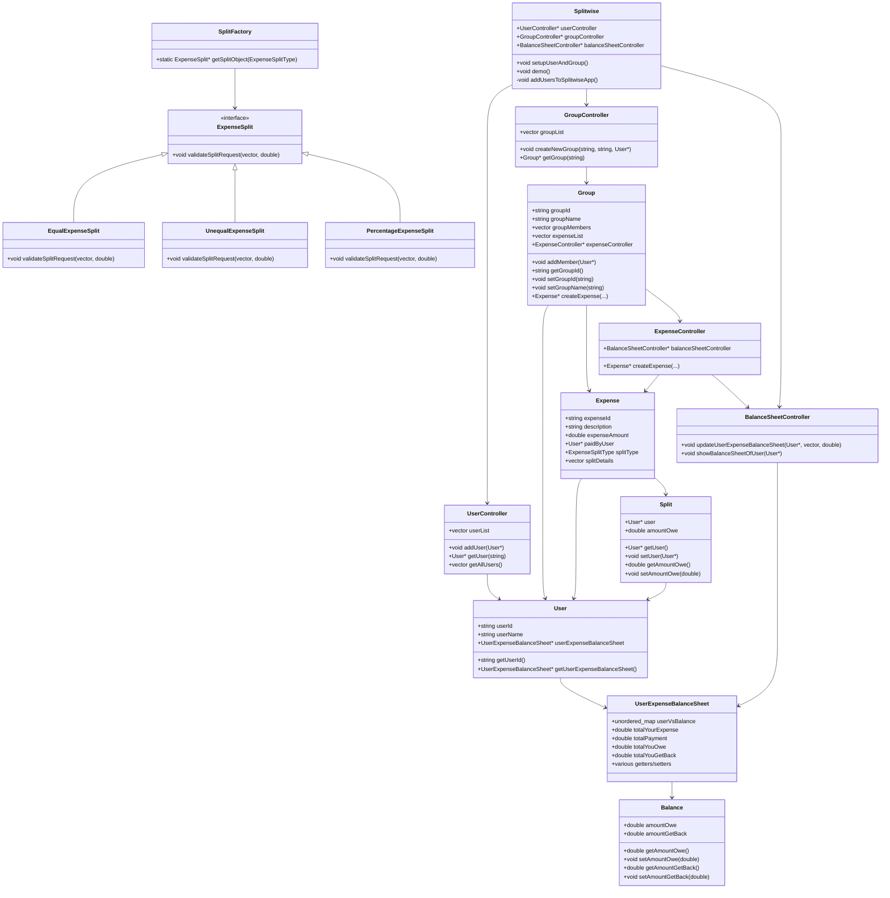
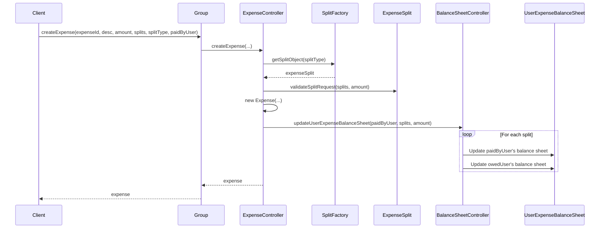
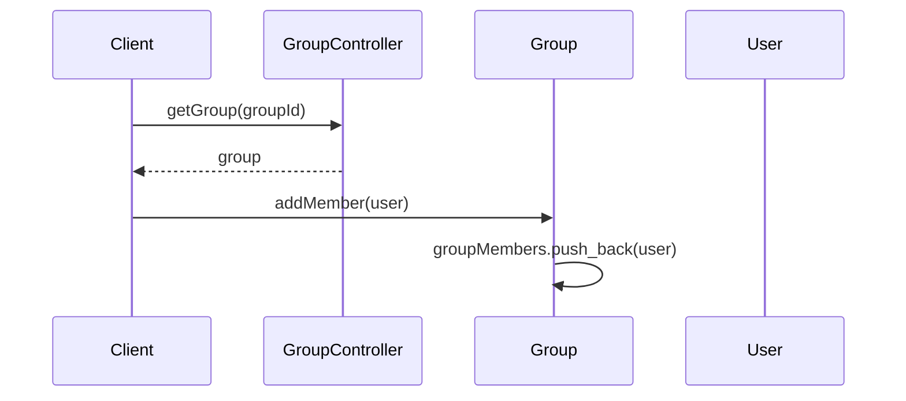
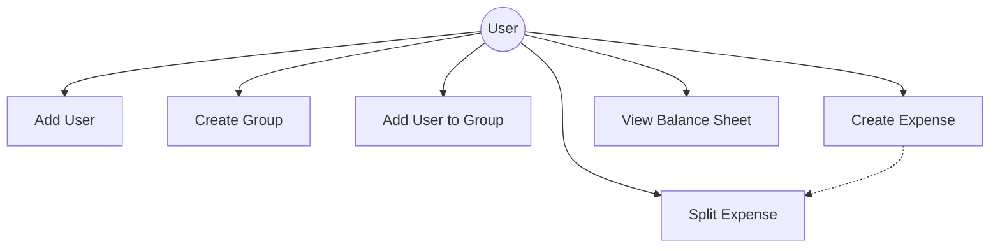
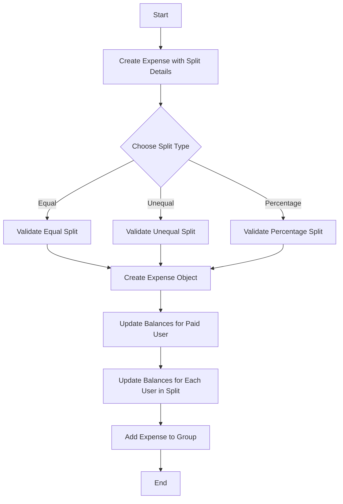
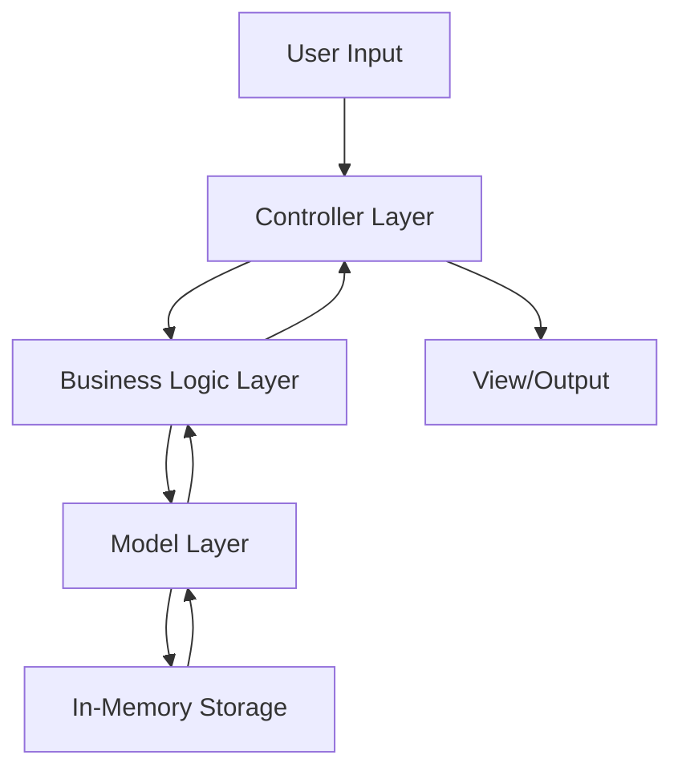

# Splitwise Application - Low-Level Design Documentation

## Table of Contents
1. [Introduction](#introduction)
2. [System Overview](#system-overview)
3. [Core Components](#core-components)
4. [Class Diagram](#class-diagram)
5. [Sequence Diagrams](#sequence-diagrams)
6. [Use Case Diagram](#use-case-diagram)
7. [Activity Diagram](#activity-diagram)
8. [Data Flow Diagram](#data-flow-diagram)
9. [Design Patterns Used](#design-patterns-used)
10. [Implementation Details](#implementation-details)
11. [Conclusion](#conclusion)

## Introduction

Splitwise is an expense sharing application that helps users split bills and keep track of balances between friends. This document explains the low-level design of the Splitwise application implemented in C++, detailing the classes, relationships, and workflows within the system.

## System Overview

The Splitwise application is designed using object-oriented principles to create an expense sharing system. The core functionality includes:

- User management
- Group creation and member management
- Expense creation with various split types (Equal, Unequal, Percentage)
- Balance sheet tracking between users
- Transaction history management

## Core Components

The system is organized into several key components:

### User Management
- `User` - Represents a user with personal details and balance sheet
- `UserController` - Manages user operations and persistence

### Group Management
- `Group` - Represents a group of users sharing expenses
- `GroupController` - Manages group operations

### Expense Management
- `Expense` - Represents an expense with details
- `ExpenseController` - Manages expense operations
- `Split` types - Different ways to divide an expense

### Balance Sheet Management
- `UserExpenseBalanceSheet` - Tracks a user's expenses and balances
- `Balance` - Records how much a user owes or is owed
- `BalanceSheetController` - Manages balance operations

## Class Diagram



## Sequence Diagrams

### Creating an Expense



### Adding a User to a Group



## Use Case Diagram



## Activity Diagram

### Creating and Splitting an Expense



## Data Flow Diagram



## Design Patterns Used

### 1. Factory Pattern
The `SplitFactory` class implements the Factory Pattern to create appropriate `ExpenseSplit` implementations based on the requested split type:

```cpp
static ExpenseSplit *getSplitObject(ExpenseSplitType splitType)
{
    switch (splitType)
    {
    case EQUAL:
        return new EqualExpenseSplit();
    case UNEQUAL:
        return new UnequalExpenseSplit();
    case PERCENTAGE:
        return new PercentageExpenseSplit();
    default:
        return nullptr;
    }
}
```

### 2. Strategy Pattern
Different expense splitting strategies (`EqualExpenseSplit`, `UnequalExpenseSplit`, `PercentageExpenseSplit`) implement the `ExpenseSplit` interface, allowing the system to handle different splitting algorithms interchangeably:

```cpp
class ExpenseSplit{
    public:
        virtual void validateSplitRequest(vector<Split*> splitList, double totalAmount) = 0;
};
```

### 3. Controller Pattern
The application uses dedicated controllers (`UserController`, `GroupController`, `ExpenseController`, `BalanceSheetController`) to handle operations for different domains.

### 4. MVC-inspired Architecture
Although not strictly following MVC, the application separates data (models like `User`, `Group`), logic (controllers), and presentation (output methods).

## Implementation Details

### Balance Sheet Management

The core of the Splitwise application is its balance sheet management system. When an expense is created, the `BalanceSheetController` updates the balance sheets of all involved users:

```cpp
void updateUserExpenseBalanceSheet(User *expensePaidBy, vector<Split *> splits, double totalExpenseAmount)
{
    UserExpenseBalanceSheet *paidByUserExpenseSheet = expensePaidBy->getUserExpenseBalanceSheet();
    paidByUserExpenseSheet->setTotalPayment(paidByUserExpenseSheet->getTotalPayment() + totalExpenseAmount);

    for (auto split : splits)
    {
        User *userOwe = split->getUser();
        UserExpenseBalanceSheet *oweUserExpenseSheet = userOwe->getUserExpenseBalanceSheet();
        double oweAmount = split->getAmountOwe();

        if (expensePaidBy->getUserId() == userOwe->getUserId())
        {
            paidByUserExpenseSheet->setTotalYourExpense(paidByUserExpenseSheet->getTotalYourExpense() + oweAmount);
        }
        else
        {
            paidByUserExpenseSheet->setTotalYouGetBack(paidByUserExpenseSheet->getTotalYouGetBack() + oweAmount);

            Balance *userOweBalance;
            if (paidByUserExpenseSheet->userVsBalance.count(userOwe->getUserId()) > 0)
            {
                userOweBalance = paidByUserExpenseSheet->userVsBalance[userOwe->getUserId()];
            }
            else
            {
                userOweBalance = new Balance();
                paidByUserExpenseSheet->userVsBalance[userOwe->getUserId()] = userOweBalance;
            }

            userOweBalance->setAmountGetBack(userOweBalance->getAmountGetBack() + oweAmount);

            oweUserExpenseSheet->setTotalYouOwe(oweUserExpenseSheet->getTotalYouOwe() + oweAmount);
            oweUserExpenseSheet->setTotalYourExpense(oweUserExpenseSheet->getTotalYourExpense() + oweAmount);

            Balance *userPaidBalance;
            if (oweUserExpenseSheet->userVsBalance.count(expensePaidBy->getUserId()) > 0)
            {
                userPaidBalance = oweUserExpenseSheet->userVsBalance[expensePaidBy->getUserId()];
            }
            else
            {
                userPaidBalance = new Balance();
                oweUserExpenseSheet->userVsBalance[expensePaidBy->getUserId()] = userPaidBalance;
            }
            userPaidBalance->setAmountOwe(userPaidBalance->getAmountOwe() + oweAmount);
        }
    }
}
```

This method:
1. Updates the total payment for the user who paid the expense
2. For each split:
   - If the split user is the same as the payer, updates their own expense total
   - If different, updates both the payer's "get back" amount and the other user's "owe" amount

### Expense Creation Flow

The expense creation flow shows how various components interact:

1. `Group` receives a request to create an expense
2. It delegates to `ExpenseController.createExpense()`
3. `ExpenseController` uses `SplitFactory` to get the appropriate split validator
4. The split validator ensures the split request is valid
5. A new `Expense` object is created
6. `BalanceSheetController` updates all relevant user balance sheets
7. The expense is returned and added to the group's expense list

## Conclusion

The Splitwise application demonstrates a well-structured object-oriented design with clear separation of concerns. Key design decisions include:

1. **Modular Architecture**: The code is organized into logical components with well-defined responsibilities.
2. **Extensibility**: The system can be extended to support new split types by adding new implementations of the `ExpenseSplit` interface.
3. **Balance Tracking**: The application maintains comprehensive balance information between users.

Areas that could be enhanced include:
- Persistence of data (currently in-memory only)
- Additional expense settlement features
- User authentication and authorization
- Better validation in some of the split types (Percentage and Unequal)
- Support for recurring expenses
