# Composite Design Pattern Implementation

## Overview

The code provided implements the Composite Design Pattern to build a simple arithmetic expression evaluator. This pattern allows you to compose objects into tree structures to represent part-whole hierarchies, letting clients treat individual objects and compositions uniformly.

In this implementation:
- Expressions are composed of numbers and other expressions
- The pattern supports operations like addition, subtraction, multiplication, and division
- Each component in the hierarchy shares a common interface for evaluation

## Classes and Components

### Core Components

1. **ArithmeticExpression (Abstract Class)**
   - Interface that all expression components must implement
   - Declares the `evaluate()` method

2. **Number (Leaf)**
   - Represents a simple numeric value
   - Concrete implementation of ArithmeticExpression
   - The "leaf" nodes in the composite structure

3. **Expression (Composite)**
   - Represents operations between expressions
   - Can hold and manage child components (left and right expressions)
   - Performs arithmetic operations (ADD, SUBTRACT, MULTIPLY, DIVIDE)

4. **Operation (Enum)**
   - Defines the available operations for expressions

## UML Class Diagram

```mermaid
classDiagram
    class ArithmeticExpression {
        <<abstract>>
        +evaluate() int
    }
    
    class Number {
        -value: int
        +Number(value: int)
        +evaluate() int
    }
    
    class Expression {
        -left: ArithmeticExpression*
        -right: ArithmeticExpression*
        -operation: Operation
        +Expression(left: ArithmeticExpression*, right: ArithmeticExpression*, operation: Operation)
        +evaluate() int
    }
    
    class Operation {
        <<enumeration>>
        ADD
        SUBTRACT
        MULTIPLY
        DIVIDE
    }
    
    ArithmeticExpression <|-- Number
    ArithmeticExpression <|-- Expression
    Expression --> ArithmeticExpression : left
    Expression --> ArithmeticExpression : right
    Expression --> Operation : operation
```



## Object Composition Flow

The following diagram shows how objects are composed in the example from `main.cpp`:


## Evaluation Workflow

When calling `evaluate()` on the root expression, the following happens:


## Implementation Details

### ArithmeticExpression Interface

```cpp
class ArithmeticExpression{
    public:
        virtual int evaluate() = 0;
};
```

This abstract class defines the common interface that all concrete expressions must implement.

### Number Class (Leaf)

```cpp
class Number : public ArithmeticExpression{
    public: 
        int value;

        Number(int value)
        {
            this->value = value;
        }

        int evaluate() override
        {
            cout << "Number value is : " << this->value << endl;
            return value;
        }
};
```

This concrete class represents a simple value in the expression tree.

### Expression Class (Composite)

```cpp
class Expression : public ArithmeticExpression{
    public:
        ArithmeticExpression* left;
        ArithmeticExpression* right;
        Operation operation;

        Expression(ArithmeticExpression* left, ArithmeticExpression* right, Operation operation)
        {
            this->left = left;
            this->right = right;
            this->operation = operation;
        }

        int evaluate() override
        {
            int value = 0;
            switch(operation)
            {
                case Operation :: ADD:
                    value = left->evaluate() + right->evaluate();
                    break;
                case Operation ::SUBTRACT:
                    value = left->evaluate() - right->evaluate();
                    break;
                case Operation::MULTIPLY:
                    value = left->evaluate() * right->evaluate();
                    break;
                case Operation::DIVIDE:
                    value = left->evaluate() / right->evaluate();
                    break; 
            }
            cout << "Expression value is : " << value << endl;
            return value;
        }
};
```

This class can contain other ArithmeticExpression objects (either Number or other Expression objects).

## Example Usage

The `main.cpp` file demonstrates the pattern in action:

```cpp
int main()
{
    ArithmeticExpression* two = new Number(2);
    ArithmeticExpression* one = new Number(1);
    ArithmeticExpression* seven = new Number(7);

    ArithmeticExpression* add = new Expression(one, seven, Operation::ADD);
    ArithmeticExpression* multiply = new Expression(two, add, Operation::MULTIPLY);

    cout << multiply->evaluate() << endl;

    return 0;
}
```

This builds the expression `2 * (1 + 7)` and evaluates it to get 16.

## Key Benefits of the Pattern

1. **Uniformity**: Clients can treat individual objects and composite structures uniformly through the common interface.

2. **Recursion**: The pattern naturally supports recursive structures and operations.

3. **Extensibility**: New expression types can be added without changing existing code.

4. **Simplicity**: Complex expressions can be built from simple components.

## Potential Improvements

1. **Memory Management**: Add destructors to properly clean up dynamically allocated objects.

2. **Error Handling**: Add validation for operations like division by zero.

3. **Additional Operations**: Support for more complex mathematical operations.

4. **Parentheses Support**: Explicit representation of grouping in expressions.

5. **Expression Parsing**: Add capability to parse string expressions into the object structure.
