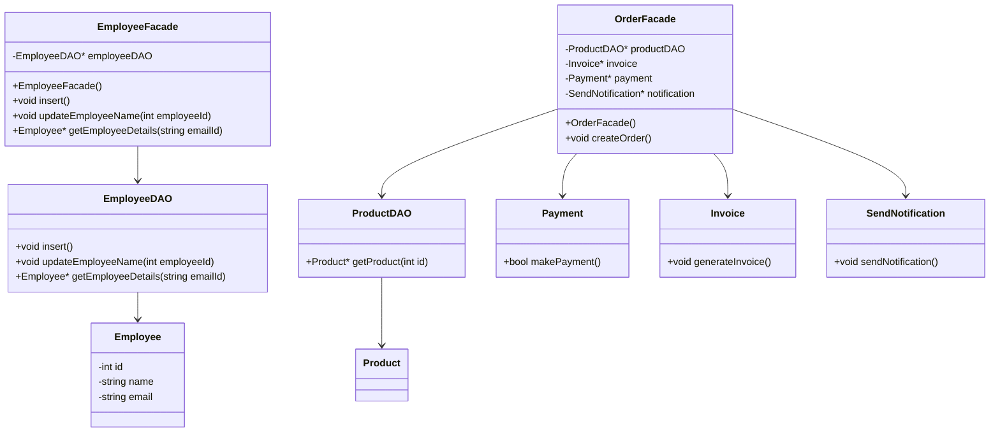
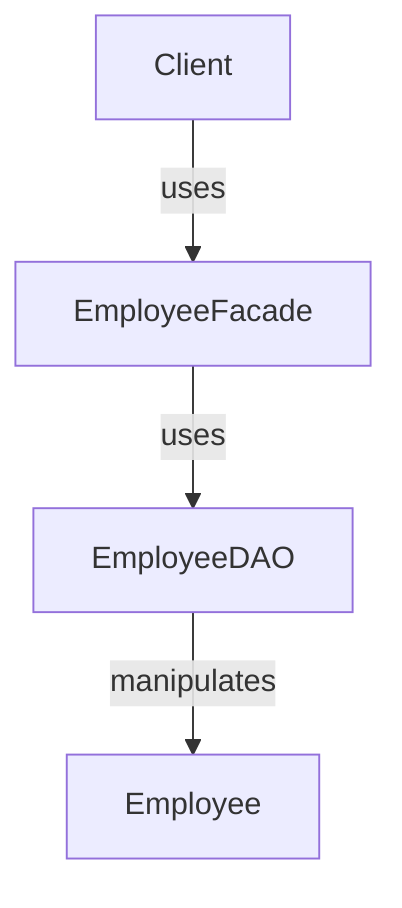
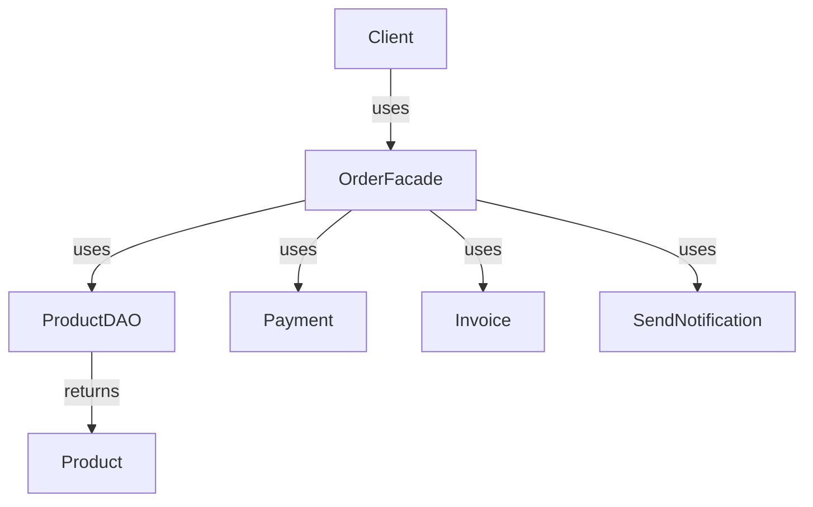
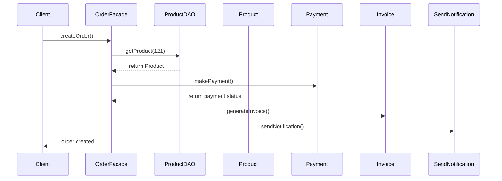
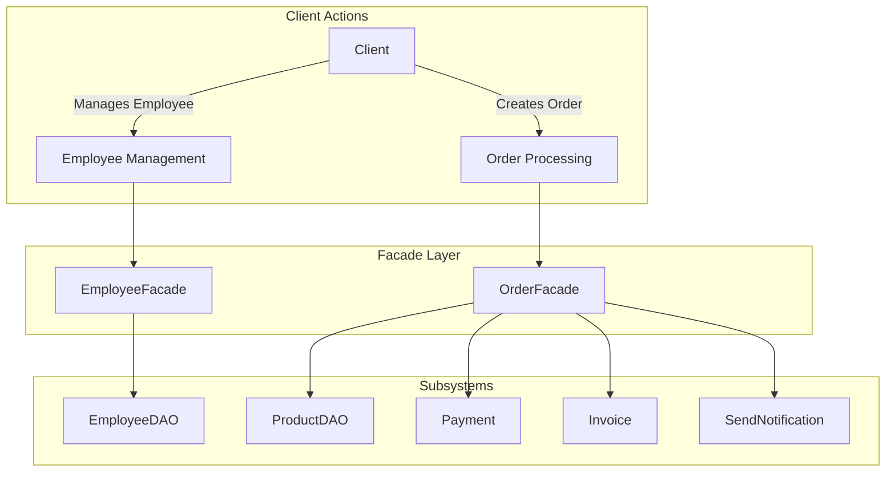
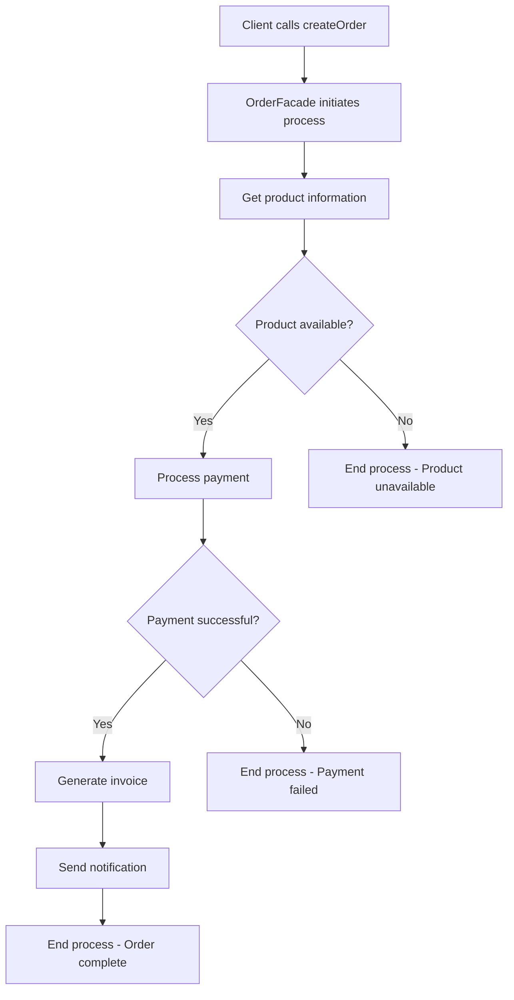

# Facade Design Pattern

## Introduction

The Facade Design Pattern is a structural pattern that provides a simplified interface to a complex subsystem of classes, components, or libraries. It encapsulates a set of interfaces in the subsystem and presents a unified, higher-level interface to make the subsystem easier to use. This pattern helps in reducing complexity and dependencies between clients and subsystems.

## Purpose

The main purposes of the Facade Pattern are:
- Simplify interface for client code
- Decouple client from subsystem components
- Reduce dependencies between client and subsystem
- Provide a single entry point to a subsystem

## Implementation in the Given Code

The provided code demonstrates two implementations of the Facade pattern:

1. **Employee Management Facade** - A simpler implementation
2. **Order Processing Facade** - A more comprehensive implementation

## Class Diagram



## Example 1: Employee Management Facade

### Components

1. **Employee** (`Employee.hpp`): A simple model class representing an employee
2. **EmployeeDAO** (`EmployeeDAO.hpp`): Data Access Object providing database operations for employees
3. **EmployeeFacade** (`EmployeeFacade.hpp`): The facade class providing a simplified interface to employee operations

### Structure



### Code Explanation

The `EmployeeFacade` simplifies client access to employee management operations:

```cpp
// Client code
EmployeeFacade* facade = new EmployeeFacade();
facade->insert();
facade->updateEmployeeName(101);
Employee* emp = facade->getEmployeeDetails("example@email.com");
```

Instead of the client having to work directly with the EmployeeDAO:

```cpp
// Without facade (client needs to know about DAO)
EmployeeDAO* dao = new EmployeeDAO();
dao->insert();
dao->updateEmployeeName(101);
Employee* emp = dao->getEmployeeDetails("example@email.com");
```

## Example 2: Order Processing Facade

### Components

1. **Product** (`Product.hpp`): A model class representing a product
2. **ProductDAO** (`ProductDAO.hpp`): Data Access Object for product retrieval
3. **Payment** (`Payment.hpp`): Handles payment processing
4. **Invoice** (`Invoice.hpp`): Generates invoices
5. **SendNotification** (`SendNotification.hpp`): Handles sending notifications
6. **OrderFacade** (`OrderFacade.hpp`): The facade coordinating the entire order process

### Structure



### Code Explanation

The `OrderFacade` encapsulates the complex flow of order processing:

```cpp
// Client code - simple!
OrderFacade* orderFacade = new OrderFacade();
orderFacade->createOrder();
```

Without the facade, the client would need to know about all subsystems and their order of operations:

```cpp
// Without facade (complex client code)
ProductDAO* productDAO = new ProductDAO();
Product* product = productDAO->getProduct(121);

Payment* payment = new Payment();
payment->makePayment();

Invoice* invoice = new Invoice();
invoice->generateInvoice();

SendNotification* notification = new SendNotification();
notification->sendNotification();
```

## Sequence Diagram for Order Processing



## Use Case Diagram



## Activity Diagram for Order Processing



## Differences Between Facade and Related Patterns

### Facade vs. Proxy Pattern

| Aspect | Facade Pattern | Proxy Pattern |
|--------|---------------|--------------|
| Intent | Simplifies complex subsystem interfaces | Controls access to an object |
| Structure | Provides a unified interface to multiple subsystems | Provides the same interface as the subject |
| Relationship | Contains multiple objects | Represents a single object |
| Purpose | Reduce complexity and dependencies | Control access, provide lazy initialization, logging, etc. |
| Client awareness | Client knows it's using a simplified interface | Client may not know it's using a proxy |
| Example | `OrderFacade` simplifies order creation process | `ImageProxy` that loads heavy images only when needed |

**Key Distinction**: 
- Facade is about **simplification** of a complex system
- Proxy is about **controlling access** to an object without changing its interface

### Facade vs. Adapter Pattern

| Aspect | Facade Pattern | Adapter Pattern |
|--------|---------------|--------------|
| Intent | Simplifies complex subsystems | Makes incompatible interfaces work together |
| Interface | Creates a new, simpler interface | Conforms to an existing interface |
| Purpose | Hide complexity | Enable compatibility |
| Object relationships | Works with multiple subsystem objects | Usually adapts a single object |
| Client | Client interacts with a simplified interface | Client interacts with a familiar interface |
| Example | `OrderFacade` for the order process | `LegacyPrinterToUSBAdapter` allowing old printers to work with USB |

**Key Distinction**:
- Facade **simplifies** existing interfaces
- Adapter **converts** incompatible interfaces to compatible ones

### Comparison Table

| Pattern | Primary Intent | Interface Change | Typical Use Case |
|---------|---------------|-----------------|-----------------|
| Facade | Simplification | Creates a new, simpler interface | Providing a unified interface to a complex subsystem |
| Proxy | Access Control | Same interface as the subject | Adding a layer of control without changing the interface |
| Adapter | Compatibility | Converts one interface to another | Making incompatible classes work together |

## Benefits of Using Facade Pattern in This Implementation

1. **Simplified Client Interface**:
   - Clients interact with one class instead of multiple subsystem components
   - The `OrderFacade.createOrder()` method handles everything in a single call

2. **Loose Coupling**:
   - Clients don't depend on subsystem classes
   - Changes to subsystems won't affect client code

3. **Organized Subsystem Dependencies**:
   - The facade manages the order of operations
   - Clients don't need to know the correct sequence of method calls

4. **Improved Readability**:
   - Client code becomes cleaner and more focused
   - Implementation details are hidden

## When to Use the Facade Pattern

1. When you need to provide a simple interface to a complex subsystem
2. When you want to layer your system and define entry points to each level
3. When there are many dependencies between clients and implementation classes
4. When you want to structure a subsystem into layers

## Common Misconceptions

- **Facade vs Adapter**: Adapter pattern makes incompatible interfaces work together; Facade simplifies a complex interface
- **Facade vs Proxy**: Proxy controls access to an object while maintaining the same interface; Facade provides a new interface
- **Not Just Forwarding**: Facade isn't just method forwarding - it should coordinate interactions between subsystems

## Conclusion

The Facade Design Pattern offers a straightforward way to simplify complex system interactions. In the provided code examples, we can see how it encapsulates complex subsystem dependencies and presents a unified interface to clients.

The pattern is particularly valuable in the `OrderFacade` example, where a single method call coordinates product retrieval, payment processing, invoice generation, and notification - operations that would otherwise require the client to understand and coordinate multiple subsystems.
