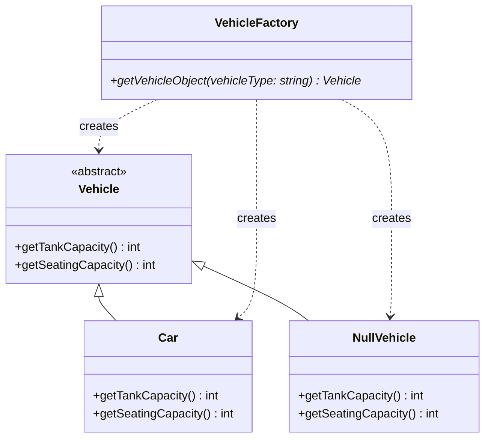
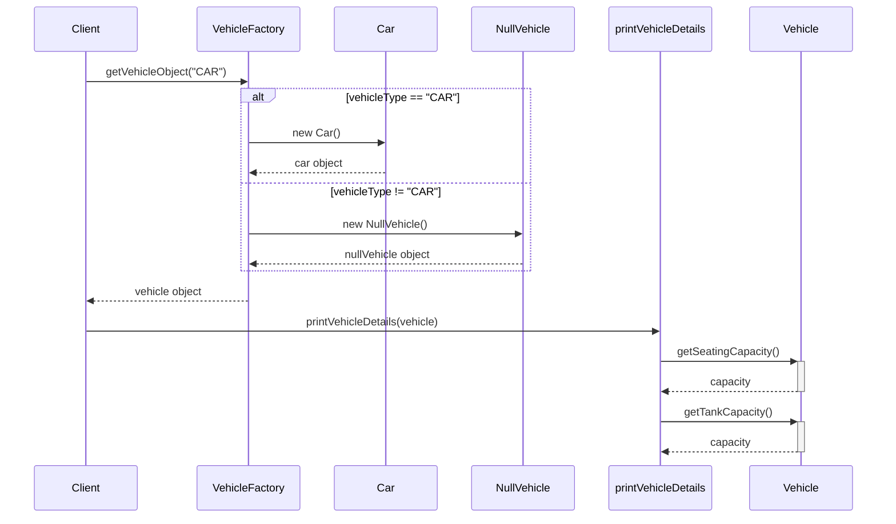

# Null Object Design Pattern

## Introduction

The Null Object Design Pattern is a behavioral design pattern that provides an elegant way to handle null references by using a special "null" implementation of an interface or abstract class. Instead of using null references and performing null checks throughout the codebase, we create a concrete "null object" that provides neutral or "do nothing" behavior.

## Problem

When a class depends on an interface or abstract class, there are scenarios where we might not have a valid implementation to provide. In such cases, we often resort to:

1. Returning null from methods
2. Performing null checks before using the object
3. Throwing exceptions when an object is not available

This leads to:
- Cluttered code with numerous null checks
- Potential NullPointerExceptions if checks are missed
- Reduced readability and maintainability

## Solution

The Null Object pattern solves these issues by:

1. Creating a concrete "null" implementation of the interface/abstract class
2. Ensuring this implementation provides neutral or "do nothing" behavior
3. Returning this null object instead of null references

This eliminates the need for null checks and ensures the code will continue to work normally even when no "real" object is available.

## Code Example Analysis

Let's analyze the provided code example:

### Class Structure

1. **Vehicle (Abstract Base Class)**
   - Defines the interface with two pure virtual methods:
     - `getTankCapacity()`
     - `getSeatingCapacity()`

2. **Car (Concrete Implementation)**
   - Implements `Vehicle` interface with real functionality
   - Returns actual values for tank capacity (40) and seating capacity (5)

3. **NullVehicle (Null Object Implementation)**
   - Also implements `Vehicle` interface
   - Provides neutral implementations returning 0 for all methods

4. **VehicleFactory**
   - Factory class that instantiates appropriate vehicle objects
   - Returns a `Car` object when "CAR" is requested
   - Returns a `NullVehicle` object when an unsupported vehicle type is requested

5. **Main Program Flow**
   - Requests a vehicle from the factory
   - Uses the vehicle object without checking if it's null

### Key Points in the Implementation

1. **Abstraction**: The `Vehicle` abstract class defines the interface that all concrete implementations must follow.

2. **Real Object**: The `Car` class provides actual implementation with meaningful values.

3. **Null Object**: The `NullVehicle` class provides neutral behavior that does nothing harmful.

4. **Factory Method**: The `VehicleFactory` decides whether to return a real object or a null object.

5. **Client Code**: The `printVehicleDetails` function works without null checks because it always receives a valid object.

## UML Class Diagram



## Data Flow Diagram

```mermaid
flowchart TD
    A[Client] -->|Requests vehicle| B[VehicleFactory]
    B -->|vehicleType == "CAR"| C[Create Car]
    B -->|vehicleType != "CAR"| D[Create NullVehicle]
    C -->|Return| E[Vehicle Object]
    D -->|Return| E
    E -->|Use| F[printVehicleDetails]
    F -->|Call methods| G[getTankCapacity/getSeatingCapacity]
    G -->|Print results| H[Output]
```

## Sequence Diagram



## Benefits of the Null Object Pattern

1. **Eliminates Null Checks**: Client code doesn't need to check if an object is null before using it.

2. **Simplifies Code**: Reduces conditional logic and makes code more readable.

3. **Prevents Null Pointer Exceptions**: Since a real object is always returned, null reference errors are eliminated.

4. **Maintains Encapsulation**: Client code doesn't need to know whether it's working with a real or null object.

5. **Follows Open/Closed Principle**: New "real" implementations can be added without modifying existing code.

## When to Use the Null Object Pattern

Use this pattern when:

1. You need to differentiate between a "no object" state and an object with neutral behavior.
2. You want to avoid null checks throughout your codebase.
3. You want default/do-nothing behavior to be provided when an object is not available.
4. You have client code that would otherwise need null reference checking.

## When Not to Use

Avoid this pattern when:

1. Null checks are actually required for business logic.
2. You need to know specifically if an object is missing (vs. having neutral behavior).
3. The null behavior cannot be easily defined or is ambiguous.

## Example Output

When requesting a "CAR":
```
Seating Capacity: 5
Fuel Tank Capacity: 40
```

When requesting an unsupported vehicle type (e.g., "BIKE"):
```
Seating Capacity: 0
Fuel Tank Capacity: 0
```

## Conclusion

The Null Object Pattern provides a clean solution to handle the absence of objects without resorting to null references. By implementing a concrete "null" class that adheres to the same interface as real objects, we can simplify our code and make it more robust by eliminating null checks and potential null pointer exceptions.

In the provided example, the `NullVehicle` class serves as the null object implementation, allowing the client code to operate seamlessly regardless of whether a valid vehicle type was requested.
