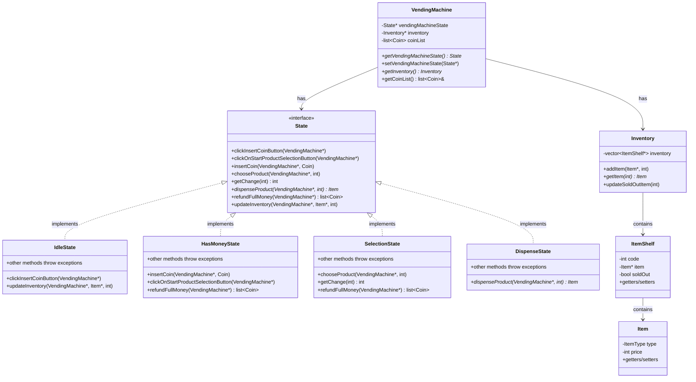
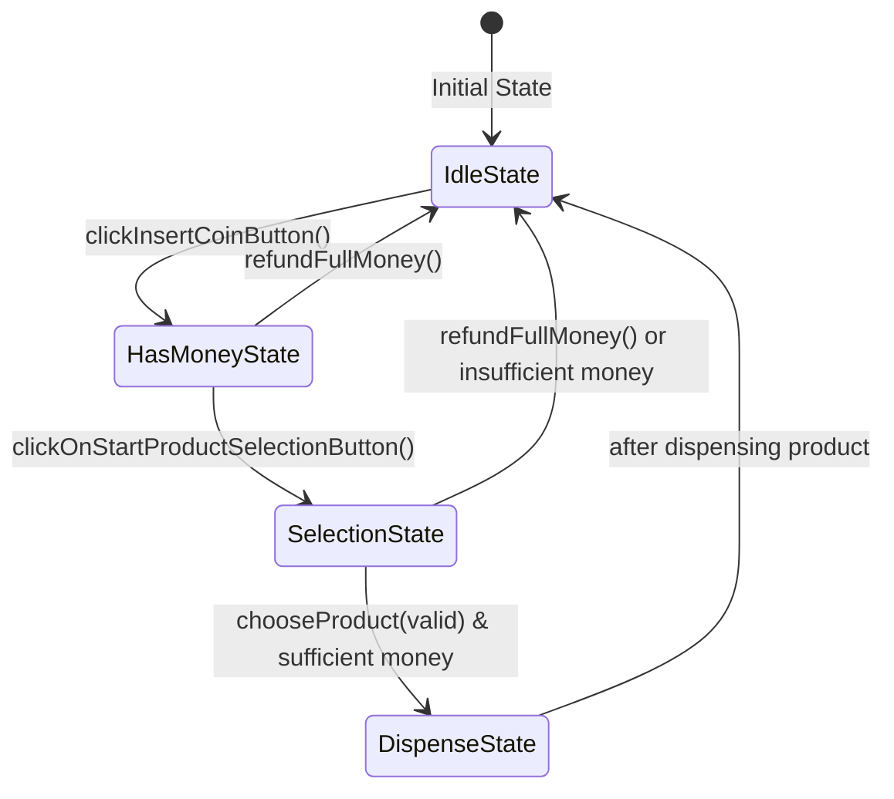
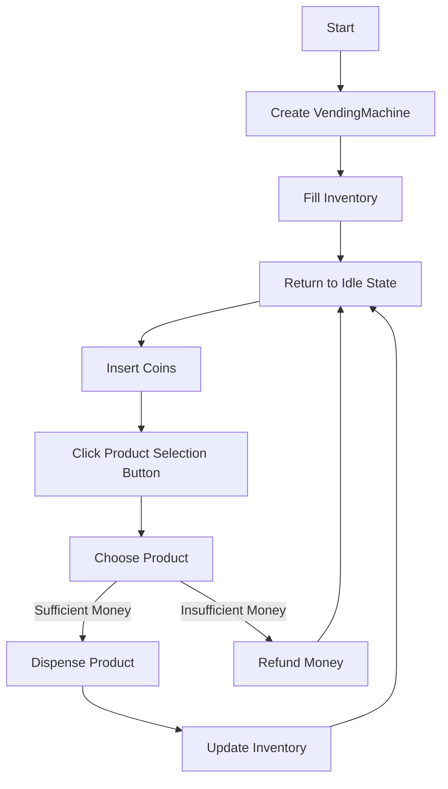
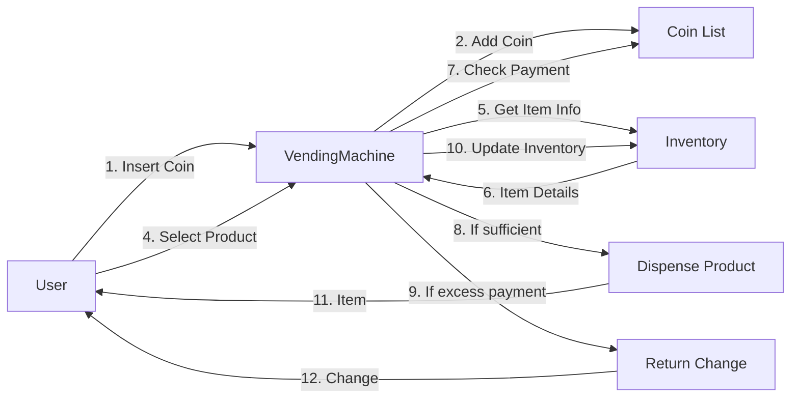

# State Design Pattern: Vending Machine Implementation

## Overview

The State Design Pattern is a behavioral design pattern that allows an object to change its behavior when its internal state changes. This pattern is exemplified in the vending machine code shared, where the machine's behavior changes based on its current state: Idle, HasMoney, Selection, or Dispense.

## State Design Pattern Explanation

In the State Pattern:
- An object (the context) has an internal state represented by a State object
- The context delegates state-specific behavior to different State subclasses
- As the context's state changes, its behavior changes without changing the context class itself

### Key Components

1. **Context Class**: `VendingMachine` - Maintains a reference to a State object and delegates state-specific behavior to it
2. **State Interface**: `State` - Defines the interface for all concrete state classes
3. **Concrete State Classes**: `IdleState`, `HasMoneyState`, `SelectionState`, and `DispenseState` - Implement state-specific behaviors

## UML Class Diagram



## State Transition Diagram



## Operation Flow Diagram



## Data Flow Diagram



## Key Implementation Details

### 1. The State Interface

The `State` interface defines a set of operations that represent actions a user can take with the vending machine:

```cpp
class State {
public:
    virtual void clickInsertCoinButton(VendingMachine *machine) throw(exception) = 0;
    virtual void clickOnStartProductSelectionButton(VendingMachine *machine) throw(exception) = 0;
    virtual void insertCoin(VendingMachine *machine, Coin coin) throw(exception) = 0;
    virtual void chooseProduct(VendingMachine *machine, int codenumber) throw(exception) = 0;
    virtual int getChange(int returnChangeMoney) throw(exception) = 0;
    virtual Item *dispenseProduct(VendingMachine *machine, int codeNumber) throw(exception) = 0;
    virtual list<Coin> refundFullMoney(VendingMachine *machine) throw(exception) = 0;
    virtual void updateInventory(VendingMachine *machine, Item *item, int codeNumber) throw(exception) = 0;
    virtual ~State() {}
};
```

### 2. The Context Class

The `VendingMachine` class maintains a reference to the current state and delegates state-specific behavior to it:

```cpp
class VendingMachine {
    State *vendingMachineState;
    Inventory *inventory;
    list<Coin> coinList;

public:
    // Methods and constructors
    void setVendingMachineState(State *state) {
        this->vendingMachineState = state;
    }
};
```

### 3. State Transitions

State transitions occur when certain actions are performed. For example:

- When `clickInsertCoinButton()` is called in `IdleState`, it transitions to `HasMoneyState`
- When `clickOnStartProductSelectionButton()` is called in `HasMoneyState`, it transitions to `SelectionState`
- When `chooseProduct()` is called in `SelectionState` with valid conditions, it transitions to `DispenseState`

The key transition implementations are:

```cpp
// From IdleState to HasMoneyState
void IdleState::clickInsertCoinButton(VendingMachine *machine) throw(exception) {
    machine->setVendingMachineState(new HasMoneyState());
}

// From HasMoneyState to SelectionState
void HasMoneyState::clickOnStartProductSelectionButton(VendingMachine *machine) throw(exception) {
    machine->setVendingMachineState(new SelectionState());
}

// From SelectionState to DispenseState
void SelectionState::chooseProduct(VendingMachine *machine, int codenumber) throw(exception) {
    // Check if sufficient money...
    if (paidByUser >= item->getPrice()) {
        // Handle change if needed...
        machine->setVendingMachineState(new DispenseState(machine, codenumber));
    }
}

// From DispenseState back to IdleState
Item *DispenseState::dispenseProduct(VendingMachine *machine, int codeNumber) throw(exception) {
    // Dispense product logic...
    machine->setVendingMachineState(new IdleState(machine));
    return item;
}
```

### 4. State-Specific Behavior

Each state implements the operations differently:

- In `IdleState`, most operations throw exceptions except `clickInsertCoinButton()` and `updateInventory()`
- In `HasMoneyState`, you can insert coins but can't choose products
- In `SelectionState`, you can choose products but can't insert more coins
- In `DispenseState`, you can dispense the product and then it automatically transitions back to `IdleState`

For example, trying to choose a product in `HasMoneyState` results in an exception:

```cpp
void HasMoneyState::chooseProduct(VendingMachine *machine, int codenumber) throw(exception) {
    throw("you need to click on start product selection button");
}
```

### 5. Exception Handling

The pattern uses exceptions to handle invalid operations in each state, making it clear which operations are allowed in which states:

```cpp
try {
    // Try to perform operations
    vendingState->clickInsertCoinButton(machine);
    // ...
} catch (const char *msg) {
    std::cerr << "Exception: " << msg << '\n';
}
```

## Benefits of the State Pattern in This Implementation

1. **Single Responsibility**: Each state class handles only the behaviors for that specific state
2. **Open/Closed Principle**: New states can be added without modifying existing code
3. **Eliminates Complex Conditionals**: No need for large if/else or switch statements to handle different states
4. **State Transitions are Explicit**: Clearly shows how states change through method calls
5. **Error Prevention**: Throws exceptions for invalid operations in specific states
6. **Maintainability**: Makes it easier to modify the behavior of specific states
7. **Testability**: Each state can be tested independently

## Example Usage Flow

From the `main()` function:

1. Create a new `VendingMachine` (starts in `IdleState`)
2. Fill inventory with products
3. Click insert coin button → Transitions to `HasMoneyState`
4. Insert coins (NICKEL and QUARTER) → Stays in `HasMoneyState`
5. Click product selection button → Transitions to `SelectionState`
6. Choose product (code 102) → Transitions to `DispenseState`, which dispenses the product and transitions back to `IdleState`

The flow is demonstrated in the main function:

```cpp
int main() {
    VendingMachine *machine = new VendingMachine();
    try {
        // Fill inventory...
        
        State *vendingState = machine->getVendingMachineState();
        vendingState->clickInsertCoinButton(machine);
        
        vendingState = machine->getVendingMachineState();
        vendingState->insertCoin(machine, Coin::NICKEL);
        vendingState->insertCoin(machine, Coin::QUARTER);
        
        vendingState->clickOnStartProductSelectionButton(machine);
        
        vendingState = machine->getVendingMachineState();
        vendingState->chooseProduct(machine, 102);
        
        // Clean up...
    } catch (...) {
        // Exception handling...
    }
    return 0;
}
```

## Practical Applications of the State Pattern

The State Pattern is applicable in various scenarios:

1. **User Interface Elements**: Different states for buttons (enabled, disabled, hover)
2. **Document Editors**: Different editing modes (insert, overwrite, selection)
3. **Network Connections**: States like connecting, connected, disconnected
4. **Game Development**: Character states like walking, jumping, attacking
5. **Order Processing Systems**: Order states from creation to delivery

## Conclusion

The State Design Pattern provides a clean way to organize the behavior of an object based on its internal state. In this vending machine implementation, it encapsulates state-specific behaviors in separate classes, making the code more maintainable and the state transitions explicit. This pattern is particularly useful for objects like vending machines, which have well-defined states and transitions between them.

The class diagrams and state transition diagrams help visualize how these components interact and how the machine transitions between different states based on user actions, making the system easier to understand and modify.

By leveraging the State Pattern, the vending machine implementation achieves a high degree of flexibility, allowing for easy addition of new states or modification of existing behaviors without affecting other parts of the system.
