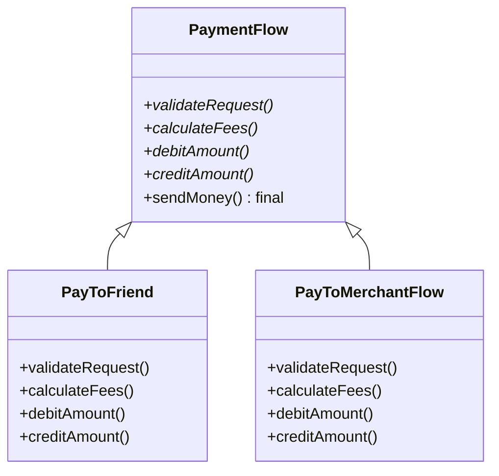
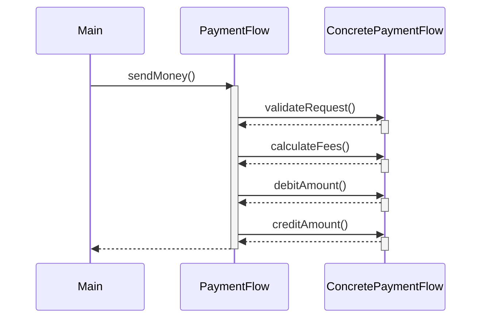
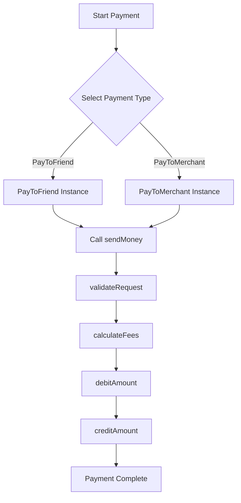
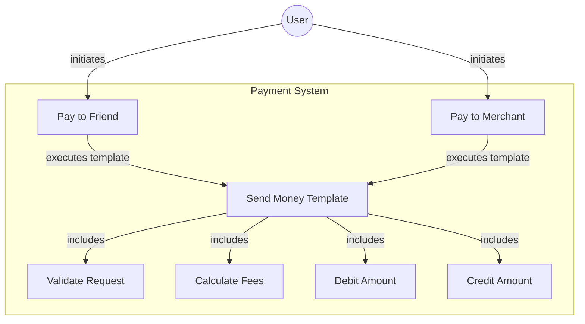
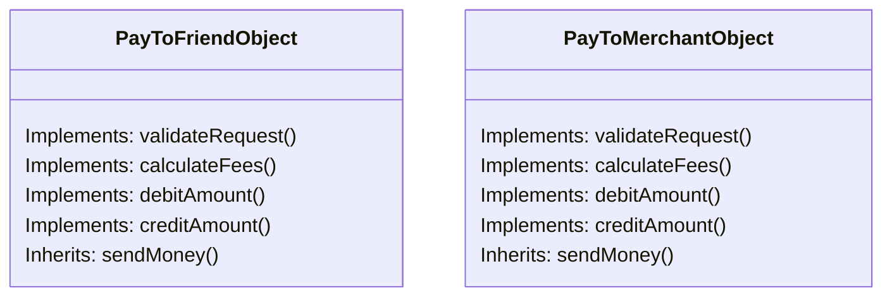
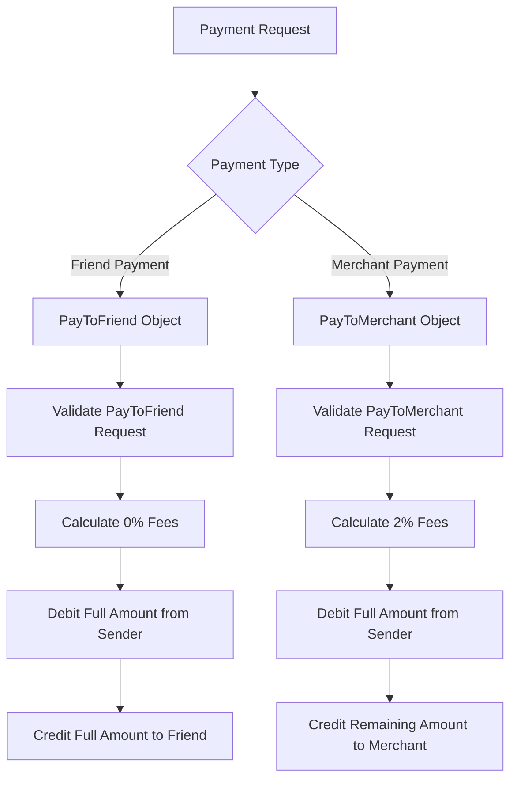

# Template Design Pattern - Payment Flow System

## Introduction

This README explains the Template Design Pattern implementation in the provided payment system. The system demonstrates how to process payments with different rules while maintaining a consistent overall process flow.

## What is the Template Design Pattern?

The Template Design Pattern defines the skeleton of an algorithm in a base class, allowing subclasses to override specific steps without changing the algorithm's structure. This pattern is particularly useful when you have:

- An algorithm with multiple steps
- Common steps across all implementations
- Specific steps that vary between implementations

## Class Structure

### UML Class Diagram



## How the Pattern Works

1. The abstract `PaymentFlow` class defines:
   - The template method `sendMoney()` which contains the fixed algorithm structure
   - Abstract methods that subclasses must implement

2. Concrete subclasses (`PayToFriend` and `PayToMerchantFlow`) provide specialized implementations for each step.

3. When `sendMoney()` is called on any concrete subclass, it follows the same algorithm steps but with specialized behavior at each step.

## Sequence Diagram

The following sequence diagram shows the flow of method calls when executing a payment:



## Activity Diagram

The following activity diagram illustrates the payment processing workflow:



## Use Case Diagram



## Object Diagram



## Data Flow Diagram



## Benefits of the Template Pattern

1. **Code Reusability**: Promotes reuse of the common algorithm structure
2. **Extensibility**: Easy to add new payment methods by creating new subclasses
3. **Consistency**: Ensures all payment flows follow the same basic steps
4. **Reduced Duplication**: Common structure defined once in the base class

## Limitations

1. **Rigid Algorithm**: The overall structure of the algorithm cannot be changed
2. **Debugging Complexity**: The flow jumps between parent and child classes, which can make debugging more challenging

## Example Output

When running the provided main.cpp:

```
Validate logic for PayToFriend
0% fees charged
Debit the Amount logic of PayToFriend
Credit the full Amount
----------------------------------------
Validate logic for PayToMerchantFlow
2% fees charged
Debit the Amount logic of PayToMerchant
Credit the remaining amount
```

## Implementation Details

- The `final` keyword in `sendMoney()` prevents subclasses from overriding the template method
- Each concrete class provides specific implementations for the abstract methods
- The client code only needs to know about the abstract `PaymentFlow` class and call `sendMoney()`

## Conclusion

The Template Design Pattern provides a powerful way to define a consistent algorithm structure while allowing specific steps to be customized. In this payment system, it ensures all payment flows follow the same basic process while accommodating different fee structures and processing rules.
