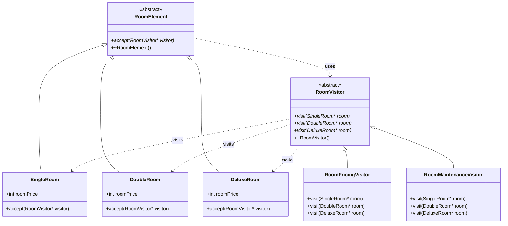
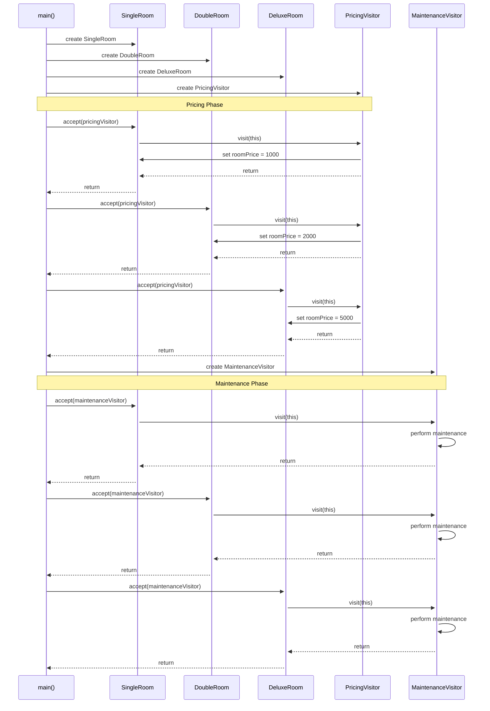
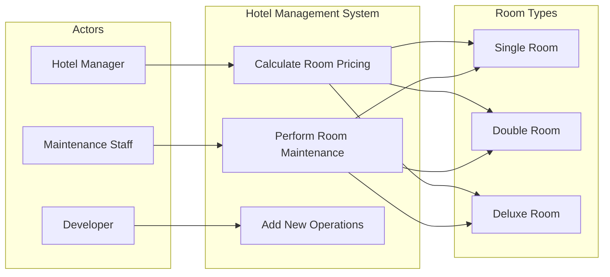

# Visitor Design Pattern - Hotel Room Management System

## Table of Contents
1. [Overview](#overview)
2. [What is the Visitor Design Pattern?](#what-is-the-visitor-design-pattern)
3. [Code Structure Analysis](#code-structure-analysis)
4. [Class Diagram](#class-diagram)
5. [Sequence Diagram](#sequence-diagram)
6. [Activity Diagram](#activity-diagram)
7. [Use Case Diagram](#use-case-diagram)
8. [Object Interaction Flow](#object-interaction-flow)
9. [Benefits and Trade-offs](#benefits-and-trade-offs)
10. [Implementation Details](#implementation-details)
11. [How to Run](#how-to-run)

## Overview

This project demonstrates the **Visitor Design Pattern** implementation using a Hotel Room Management System. The system handles different types of rooms (Single, Double, Deluxe) and performs various operations (Pricing, Maintenance) on them without modifying the room classes themselves.

## What is the Visitor Design Pattern?

The Visitor Design Pattern is a behavioral design pattern that allows you to define new operations on a set of objects without changing their classes. It separates algorithms from the objects on which they operate by moving the operational logic into separate visitor classes.

### Key Components:
- **Element Interface**: Defines the `accept()` method that takes a visitor
- **Concrete Elements**: Implement the element interface (Room types)
- **Visitor Interface**: Declares visit methods for each concrete element type
- **Concrete Visitors**: Implement specific operations (Pricing, Maintenance)

## Code Structure Analysis

```
VisitorDesignPattern/
├── RoomElement.hpp          # Abstract Element Interface
├── SingleRoom.hpp/.cpp      # Concrete Element
├── DoubleRoom.hpp/.cpp      # Concrete Element  
├── DeluxeRoom.hpp/.cpp      # Concrete Element
├── RoomVisitor.hpp          # Abstract Visitor Interface
├── RoomPricingVisitor.hpp   # Concrete Visitor
├── RoomMaintenanceVisitor.hpp # Concrete Visitor
└── main.cpp                 # Client Code
```

## Class Diagram



## Sequence Diagram



## Activity Diagram

```mermaid
flowchart TD
    A[Start] --> B[Create Room Objects]
    B --> C[Create Pricing Visitor]
    C --> D[Apply Pricing to Single Room]
    D --> E[Apply Pricing to Double Room]
    E --> F[Apply Pricing to Deluxe Room]
    F --> G[Display Room Prices]
    G --> H[Create Maintenance Visitor]
    H --> I[Apply Maintenance to Single Room]
    I --> J[Apply Maintenance to Double Room]
    J --> K[Apply Maintenance to Deluxe Room]
    K --> L[End]
    
    subgraph "Visitor Pattern Flow"
        M[Room.accept(visitor)] --> N[visitor.visit(room)]
        N --> O[Execute Operation]
        O --> P[Return to Client]
    end
```

## Use Case Diagram



## Object Interaction Flow

```mermaid
graph TD
    subgraph "Client Layer"
        Client[main.cpp]
    end
    
    subgraph "Element Layer"
        SR[SingleRoom]
        DR[DoubleRoom]
        DLR[DeluxeRoom]
        RE[RoomElement Interface]
    end
    
    subgraph "Visitor Layer"
        PV[PricingVisitor]
        MV[MaintenanceVisitor]
        RV[RoomVisitor Interface]
    end
    
    Client --> SR
    Client --> DR
    Client --> DLR
    Client --> PV
    Client --> MV
    
    SR --> RE
    DR --> RE
    DLR --> RE
    
    PV --> RV
    MV --> RV
    
    SR -.->|accept()| PV
    DR -.->|accept()| PV
    DLR -.->|accept()| PV
    
    SR -.->|accept()| MV
    DR -.->|accept()| MV
    DLR -.->|accept()| MV
    
    PV -.->|visit()| SR
    PV -.->|visit()| DR
    PV -.->|visit()| DLR
    
    MV -.->|visit()| SR
    MV -.->|visit()| DR
    MV -.->|visit()| DLR
```

## Benefits and Trade-offs

### ✅ Benefits
1. **Open/Closed Principle**: Easy to add new operations without modifying existing classes
2. **Single Responsibility**: Each visitor handles one specific operation
3. **Type Safety**: Compile-time method resolution through method overloading
4. **Centralized Logic**: Related operations are grouped in visitor classes

### ⚠️ Trade-offs
1. **Adding New Elements**: Requires updating all visitor interfaces
2. **Circular Dependencies**: Elements and visitors depend on each other
3. **Breaking Encapsulation**: Visitors may need access to element internals
4. **Complexity**: Can be overkill for simple operations

## Implementation Details

### Key Design Decisions

1. **Forward Declarations**: Used to break circular dependencies
   ```cpp
   class RoomVisitor; // Forward declaration in room headers
   ```

2. **Double Dispatch**: Achieved through accept() and visit() method combination
   ```cpp
   void SingleRoom::accept(RoomVisitor* visitor) {
       visitor->visit(this);  // Double dispatch
   }
   ```

3. **Smart Pointers**: Used in main.cpp for better memory management
   ```cpp
   std::unique_ptr<RoomElement> singleRoomObj = std::make_unique<SingleRoom>();
   ```

### Code Flow Explanation

1. **Object Creation**: Room objects and visitor objects are created
2. **Accept Call**: Client calls `room->accept(visitor)`
3. **Visit Dispatch**: Room calls `visitor->visit(this)` 
4. **Operation Execution**: Visitor executes the specific operation
5. **Return**: Control returns to client

### Polymorphism in Action

```cpp
// Polymorphic container
std::vector<std::unique_ptr<RoomElement>> rooms;
rooms.push_back(std::make_unique<SingleRoom>());
rooms.push_back(std::make_unique<DoubleRoom>());

// Polymorphic operation
for(auto& room : rooms) {
    room->accept(pricingVisitor.get());  // Correct visit() method called
}
```

## How to Run

### Prerequisites
- C++14 or later compiler (g++, clang++)
- Make (optional)

### Compilation
```bash
# Using g++
g++ -std=c++14 *.cpp -o hotel_system

# Or compile individually
g++ -std=c++14 -c SingleRoom.cpp
g++ -std=c++14 -c DoubleRoom.cpp  
g++ -std=c++14 -c DeluxeRoom.cpp
g++ -std=c++14 -c main.cpp
g++ *.o -o hotel_system
```

### Execution
```bash
./hotel_system
```

### Expected Output
```
Pricing computation logic for single room
Single Room Price: 1000
Pricing computation logic for double room  
Double Room Price: 2000
Pricing computation logic for deluxe room
Deluxe Room Price: 5000
Performing maintenance on Single Room
Performing maintenance on Double Room
Performing maintenance on Deluxe Room
```

## Extending the System

### Adding New Room Type
1. Create new room class inheriting from `RoomElement`
2. Update all visitor interfaces to include new `visit()` method
3. Implement the visit method in all concrete visitors

### Adding New Operation
1. Create new visitor class inheriting from `RoomVisitor`
2. Implement all required `visit()` methods
3. Use the new visitor with existing room objects

### Example: Adding Suite Room
```cpp
// SuiteRoom.hpp
class SuiteRoom : public RoomElement {
public:
    int roomPrice = 0;
    void accept(RoomVisitor* visitor) override;
};

// Update RoomVisitor.hpp
class RoomVisitor {
public:
    virtual void visit(SingleRoom* room) = 0;
    virtual void visit(DoubleRoom* room) = 0;
    virtual void visit(DeluxeRoom* room) = 0;
    virtual void visit(SuiteRoom* room) = 0;  // New method
};
```

This implementation showcases the power and flexibility of the Visitor Design Pattern in creating maintainable and extensible object-oriented systems.
